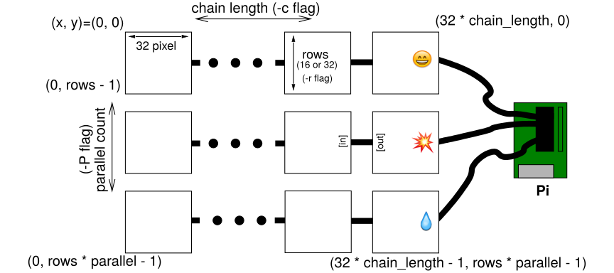
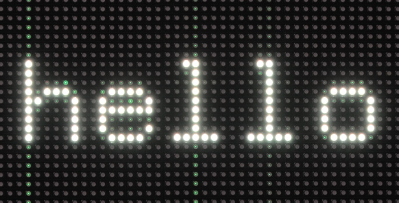
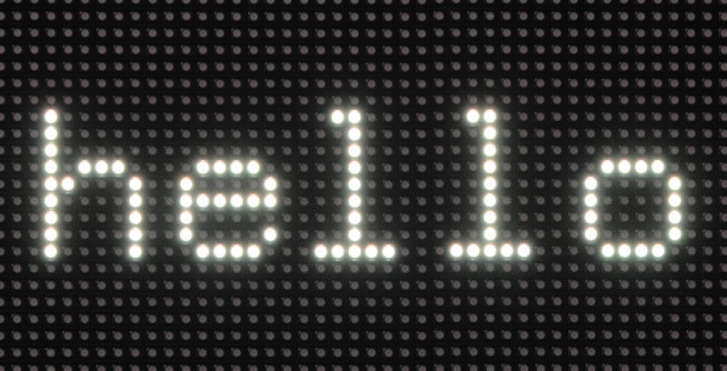
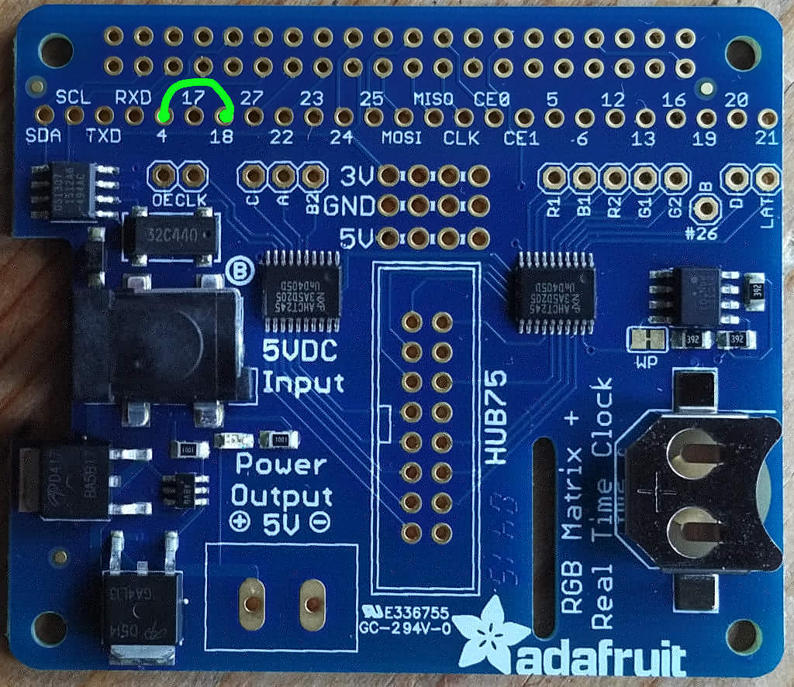
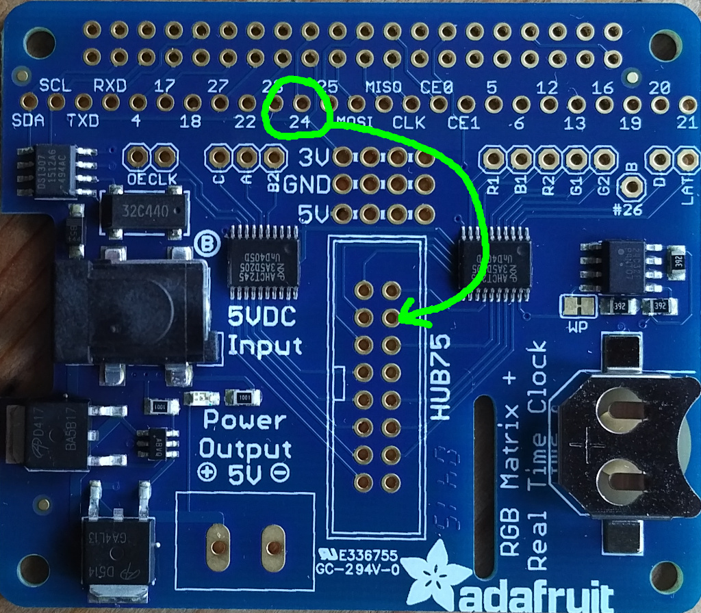
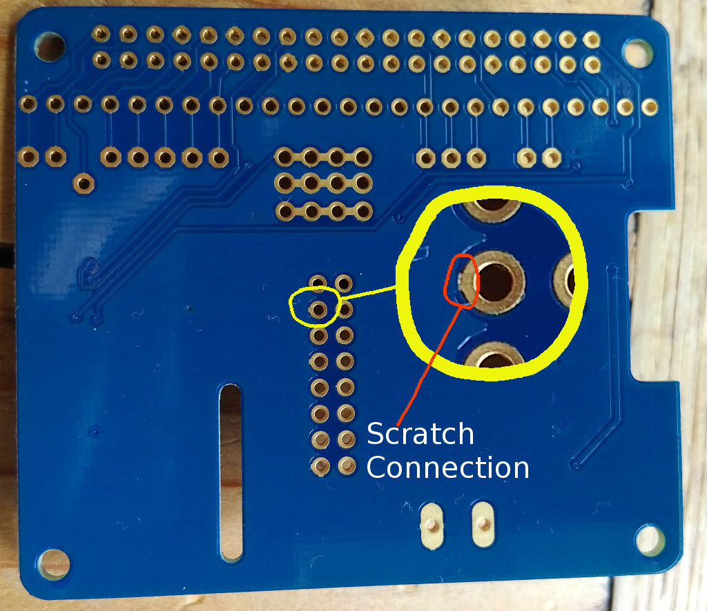

Controlling RGB LED display with Raspberry Pi GPIO
==================================================

A library to control commonly available 64x64, 32x32 or 16x32 RGB LED panels
with the Raspberry Pi. Can support PWM up to 11Bit per channel, providing
true 24bpp color with CIE1931 profile.

Supports 3 chains with many panels each on a regular Pi.
On a Raspberry Pi 2 or 3, you can easily chain 12 panels in that chain
(so 36 panels total), but you can theoretically stretch that to up
to 96-ish panels (32 chain length) and still reach
around 100Hz refresh rate with full 24Bit color (theoretical - never tested
this; there might likely be timing problems with the panels that will creep
up then).

With fewer colors or so-called 'outdoor panels' you can control even more,
faster.

The LED-matrix library is (c) Henner Zeller <h.zeller@acm.org>, licensed with
[GNU General Public License Version 2.0](http://www.gnu.org/licenses/gpl-2.0.txt)
(which means, if you use it in a product somewhere, you need to make the
source and all your modifications available to the receiver of such product so
that they have the freedom to adapt and improve).

## Discourse discussion group

If you'd like help, please do not file a bug, use the discussion board instead:
https://rpi-rgb-led-matrix.discourse.group/

Overview
--------
The RGB LED matrix panels can be scored at [Sparkfun][sparkfun],
[AdaFruit][ada] or eBay and Aliexpress. If you are in China, I'd try to get
them directly from some manufacturer, Taobao or Alibaba.

The `RGBMatrix` class provided in `include/led-matrix.h` does what is needed
to control these. You can use this as a library in your own projects or just
use the demo binary provided here which provides some useful examples.

Check out [utils/ directory for some ready-made tools](./utils) to get started
using the library, or the [examples-api-use/](./examples-api-use) directory if
you want to get started programming your own utils.

All Raspberry Pi versions supported
-----------------------------------

This supports the old Raspberry Pi's Version 1 with 26 pin header and also the
B+ models, the Pi Zero, Raspberry Pi 2 and 3 with 40 pins, as well as the
Compute Modules which have 44 GPIOs.
The 26 pin models can drive one chain of RGB panels, the 40 pin models
**up to three** chains in parallel (each chain 12 or more panels long).
The Compute Module can drive **up to 6 chains in parallel**.
The Raspberry Pi 2 and 3 are faster and generally perferred to the older
models (and the Pi Zero). With the faster models, the panels sometimes
can't keep up with the speed; check out
this [troubleshooting section](#troubleshooting) what to do.

A lightweight, non-GUI, distribution such as [DietPi] is recommended.
[Raspbian Lite][raspbian-lite] is a bit easier to get started with and
is a good second choice.

Types of Displays
-----------------
There are various types of displays that come all with the same Hub75 connector.
They vary in the way the multiplexing is happening so this library supports
options to choose that.
All these are configured by flags (or, programmatically, in an [Options struct](include/led-matrix.h#L57)).

If you have a 64x32 display, you need to supply the flags
`--led-cols=64 --led-rows=32` for instance.

Depending on the Matrix, there are various configuration options that
you might need to set for it to work. See further below in the README for the
[detailed description of these](#changing-parameters-via-command-line-flags).
While the `--led-rows` and `--led-cols` can be derived from simply looking
at the panels, the other options might require some experimenting to find the
right setting if there is no description provided by the manufacturer of
the panel. Going through these options for experiments would typically not do
harm, so you're free to experiment to find your setting.

Flag                                | Description
:---------------      | :-----------------
`--led-cols`          | Columns in the LED matrix, the 'width'.
`--led-rows`          | Rows in the LED matrix, the 'height'.
`--led-multiplexing`  | In particular bright outdoor panels with small multiplex ratios require this. Often an indicator: if there are fewer address lines than expected: ABC (instead of ABCD) for 32 high panels and ABCD (instead of ABCDE) for 64 high panels.
`--led-row-addr-type` | Adressing of rows; in particular panels with only AB address lines might indicate that this is needed.
`--led-panel-type`    | Chipset of the panel. In particular if it doesn't light up at all, you might need to play with this option because it indicates that the panel requires a particular initialization sequence.

Panels can be chained by connecting the output of one panel to the input of
the next panel. You can chain quite a few together, but the refresh rate will
reduce with longer chains.

The 64x64 matrixes typically come in two kinds: with 5 address
lines (A, B, C, D, E), or (A, B); the latter needs a `--led-row-addr-type=1`
parameter. So-called 'outdoor panels' are typically brighter and allow for
faster refresh-rate for the same size, but do some multiplexing internally
of which there are a few types out there; they can be chosen with
the `--led-multiplexing` parameter.

There are some panels that have a different chip-set than the default HUB75.
These require some initialization sequence. The current supported types are
`--led-panel-type=FM6126A` and `--led-panel-type=FM6127`.

Generally, the higher scan-rate (e.g. 1:8), a.k.a. outdoor panels generally
allow faster refresh rate, but you might need to figure out the multiplexing
mapping if one of the three provided does not work.

Some 32x16 outdoor matrixes with 1:4 scan (e.g. [Qiangli Q10(1/4) or X10(1/4)](http://qiangliled.com/products-63.html))
have 4 address line (A, B, C, D). For such matrices is necessary to
use `--led-row-addr-type=2` parameter. Also the matrix Qiangli Q10(1/4)
have "Z"-stripe pixel mapping and in this case, you'd use two parameters
at the same time `--led-row-addr-type=2 --led-multiplexing=4`.

Let's do it
------------
This documentation is split into parts that help you through the process

  1. <a href="wiring.md"></a>
    [**Wire up the matrix to your Pi**](./wiring.md). This document describes
    what goes where. You might also be interested
    in [breakout boards](./adapter) for that.
    If you have an [Adafruit HAT] or [Adafruit Bonnet], you can choose that with
    a command line option [described below](#if-you-have-an-adafruit-hat-or-bonnet)
  2. Run a demo. You find that in the
     [examples-api-use/](./examples-api-use#running-some-demos) directory:
```
make -C examples-api-use
sudo examples-api-use/demo -D0
```
  3. Use the utilities. The [utils](./utils) directory has some ready-made
    useful utilities to show content. [Go there](./utils) to see how to
    compile and run these.
  4. Write your own programs using the Matrix in C++ or one of the
     bindings such as Python or C#.

### Utilities

The [utils directory](./utils) is meant for ready utilities to show images or
animated gifs or videos. Read the [README](./utils/README.md) there for
instructions how to compile.

There are external projects that use this library and provide higher level
network protocols, such as the
 * [FlaschenTaschen implementation](https://github.com/hzeller/flaschen-taschen)
   (VLC can send videos to it natively)
 * [PixelPusher implementation](https://github.com/hzeller/rpi-matrix-pixelpusher) (common in light art installations)
 * [ZeroMQ-server](https://github.com/Knifa/led-matrix-zmq-server) to receive
   content.
 * Marc's [FastLED_RPIRGBPanel_GFX](http://marc.merlins.org/perso/arduino/post_2020-01-01_Running-FastLED_-Adafruit_GFX_-and-LEDMatrix-code-on-High-Resolution-RGBPanels-with-a-Raspberry-Pi.html) allows running arduino code on linux/rPi and display on bigger RGBPanel matrices than arduino chips, can.

### API

The library comes as an API that you can use for your own utilities and use-cases.

  * The native library is a C++ library (see [include/](./include)).
    Example uses you find in the [examples-api-use/](./examples-api-use)
    directory.
  * If you prefer to program in C, there is also a
    [C API](./include/led-matrix-c.h).
  * In the [python](./bindings/python) subdirectory, you find a Python API including a
    couple of [examples](./bindings/python/samples) to get started.
  * There are a couple of external bindings, such as
      * [Nodejs binding] by Maxime Journaux
      * [Nodejs/Typescript binding] by Alex Eden
      * [Go binding] by Máximo Cuadros
      * [Rust binding] by Vincent Pasquier

### Changing parameters via command-line flags

For the programs in this distribution and also automatically in your own
programs using this library, there are a lot of parameters provided as command
line flags, so that you don't have to re-compile your programs to tweak them.
Some might need to be changed for your particular kind of panel.

Here is a little run-down of what these command-line flags do and when you'd
like to change them.

First things first: if you have a different wiring than described in
[wiring](./wiring.md), for instance if you have an Adafruit HAT/Bonnet, you can
choose these here:

```
--led-gpio-mapping=<gpio-mapping>: Name of GPIO mapping used. Default "regular"
```

This can have values such as
  - `--led-gpio-mapping=regular` The standard mapping of this library, described in the [wiring](./wiring.md) page.
  - `--led-gpio-mapping=adafruit-hat` The Adafruit HAT/Bonnet, that uses this library or
  - `--led-gpio-mapping=adafruit-hat-pwm` Adafruit HAT with the anti-flicker hardware mod [described below](#improving-flicker).
  - `--led-gpio-mapping=compute-module` Additional 3 parallel chains can be used with the Compute Module.

Learn more about the mappings in the [wiring documentation](wiring.md#alternative-hardware-mappings).

#### GPIO speed

```
--led-slowdown-gpio=<0..4>: Slowdown GPIO. Needed for faster Pis and/or slower panels (Default: 1).
```

The Raspberry Pi starting with Pi2 are putting out data too fast for almost
all LED panels I have seen. In this case, you want to slow down writing to
GPIO. Zero for this parameter means 'no slowdown'.

The default 1 (one) typically works fine, but often you have to even go further
by setting it to 2 (two). If you have a Raspberry Pi with a slower processor
(Model A, A+, B+, Zero), then a value of 0 (zero) might work and is desirable.

A Raspberry Pi 3 or Pi4 might even need higher values for the panels to be
happy.

#### Panel Connection
The next most important flags describe the type and number of displays connected

```
--led-rows=<rows>        : Panel rows. Typically 8, 16, 32 or 64. (Default: 32).
--led-cols=<cols>        : Panel columns. Typically 32 or 64. (Default: 32).
--led-chain=<chained>    : Number of daisy-chained panels. (Default: 1).
--led-parallel=<parallel>: For A/B+ models or RPi2,3b: parallel chains. range=1..3 (Default: 1, 6 for Compute Module).
```

These are the most important ones: here you choose how many panels you have
connected and how many rows are in each panel. Panels can be chained (each panel
has an input and output connector, see the
[wiring documentation](wiring.md#chains)) -- the `--led-chain` flag tells the
library how many panels are chained together. The newer Raspberry Pi's allow
to connect multiple chains in parallel, the `--led-parallel` flag tells it how
many there are.

This illustrates what each of these parameters mean:

<a href="wiring.md#chaining-parallel-chains-and-coordinate-system"></a>

##### Panel Type

Typically, panels should just work out of the box, but some panels use a
different chip-set that requires some initialization. If you don't see any
output on your panel, try setting:

```
--led-panel-type=FM6126A
```

Some panels have the FM6127 chip, which is also an option.

##### Multiplexing
If you have some 'outdoor' panels or panels with different multiplexing,
the following will be useful:

```
--led-multiplexing=<0..17> : Mux type: 0=direct; 1=Stripe; 2=Checkered...
```

The outdoor panels have different multiplexing which allows them to be faster
and brighter, but by default their output looks jumbled up.
They require some pixel-mapping of which there are a few
types you can try and hopefully one of them works for your panel; The default=0
is no mapping ('standard' panels), while 1, 2, ... are different mappings
to try with. If your panel has a different mapping, you find everything you
need to implement one in [lib/multiplex-mappers.cc](lib/multiplex-mappers.cc).
Please send a pull request if you encounter a panel for which you needed to
implement a new mapping.

Note that you have to set the `--led-rows` and `--led-cols` to the rows and
columns that are physically on each chained panel so that the multiplexing
option can work properly. For instance a `32x16` panel with `1:4` multiplexing
would be controlled with `--led-rows=16 --led-cols=32 --led-multiplexing=1` (or
whatever multiplexing type your panel is, so it can also be `--led-multiplexing=2` ...).

For `64x32` panels with `1:8` multiplexing, this would typically be
`--led-rows=32 --led-cols=64 --led-multiplexing=1`;
however, there are some panels that internally behave like
two chained panels, so then you'd use
`--led-rows=32 --led-cols=32 --led-chain=2 --led-multiplexing=1`;

```
--led-row-addr-type=<0..4>: 0 = default; 1 = AB-addressed panels; 2 = direct row select; 3 = ABC-addressed panels; 4 = ABC Shift + DE direct (Default: 0).
```

This option is useful for certain 64x64 or 32x16 panels. For 64x64 panels,
that only have an `A` and `B` address line, you'd use `--led-row-addr-type=1`.
This is only tested with one panel so far, so if it doesn't work for you,
please send a pull request.

For 32x16 outdoor panels, that have have 4 address line (A, B, C, D), it is
necessary to use `--led-row-addr-type=2`.

#### Panel Arrangement

```
--led-pixel-mapper  : Semicolon-separated list of pixel-mappers to arrange pixels.
```

Optional params after a colon e.g. "U-mapper;Rotate:90"

Available | Parameter after colon| Example
----------|----------------------|----------
Mirror    | `H` or `V` for horizontal/vertical mirror. | `Mirror:H`
Rotate    | Degrees.                                   | `Rotate:90`
U-mapper  | -

Mapping the logical layout of your boards to your physical arrangement. See
more in [Remapping coordinates](./examples-api-use#remapping-coordinates).

#### Misc Options

```
--led-brightness=<percent>: Brightness in percent (Default: 100).
```

Self explanatory.


```
--led-pwm-bits=<1..11>    : PWM bits (Default: 11).
```

The LEDs can only be switched on or off, so the shaded brightness perception
is achieved via PWM (Pulse Width Modulation). In order to get a good 8 Bit
per color resolution (24Bit RGB), the 11 bits default per color are good
(why ? Because our eyes are actually perceiving brightness logarithmically, so
we need a lot more physical resolution to get 24Bit sRGB).

With this flag, you can change how many bits it should use for this; lowering it
means the lower bits (=more subtle color nuances) are omitted.
Typically you might be mostly interested in the extremes: 1 Bit for situations
that only require 8 colors (e.g. for high contrast text displays) or 11 Bit
for everything else (e.g. showing images or videos). Why would you bother at all ?
Lower number of bits use slightly less CPU and result in a higher refresh rate.

```
--led-show-refresh        : Show refresh rate.
```

This shows the current refresh rate of the LED panel, the time to refresh
a full picture. Typically, you want this number to be pretty high, because the
human eye is pretty sensitive to flicker. Depending on the settings, the
refresh rate with this library are typically in the hundreds of Hertz but
can drop low with very long chains. Humans have different levels of perceiving
flicker - some are fine with 100Hz refresh, others need 250Hz.
So if you are curious, this gives you the number (shown on the terminal).

The refresh rate depends on a lot of factors, from `--led-rows` and `--led-chain`
to `--led-pwm-bits`, `--led-pwm-lsb-nanoseconds` and `--led-pwm-dither-bits`.
If you are tweaking these parameters, showing the refresh rate can be a
useful tool.

```
--led-limit-refresh=<Hz>  : Limit refresh rate to this frequency in Hz. Useful to keep a
                            constant refresh rate on loaded system. 0=no limit. Default: 0
```

This allows to limit the refresh rate to a particular frequency to approach
a fixed refresh rate.

This can be used to mitigate some situations in which you have a faint flicker,
which can happen due to hardware events (network access)
or other situations such as other IO or heavy memory access by other
processes. Also when you see wildly changing refresh frequencies with
`--led-show-refresh`.

You trade a slightly slower refresh rate and display brightness for less
visible flicker situations.

For this to calibrate, run your program for a while with --led-show-refresh
and watch the line that shows the current refresh rate and minimum refresh
rate observed. So wait a while until that value doesn't
change anymore (e.g. a minute, so that you catch tasks that happen once
a minute, such as ntp updated).
Use this as a guidance what value to choose with `--led-limit-refresh`.

The refresh rate will now be adapted to always reach this value
between frames, so faster refreshes will be slowed down, but the occasional
delayed frame will fit into the time-window as well, thus reducing visible
brightness fluctuations.

You can play with value a little and reduce until you find a good balance
between refresh rate and flicker suppression.

Use this also if you want to have a stable baseline refresh rate when using
the vsync-multiple flag `-V` in the [led-image-viewer] or
[video-viewer] utility programs.

```
--led-scan-mode=<0..1>    : 0 = progressive; 1 = interlaced (Default: 0).
```

This switches from progressive scan and interlaced scan. The latter might
look be a little nicer when you have a very low refresh rate, but typically
it is more annoying because of the comb-effect (remember 80ies TV ?).


```
--led-pwm-lsb-nanoseconds : PWM Nanoseconds for LSB (Default: 130)
```

This allows to change the base time-unit for the on-time in the lowest
significant bit in nanoseconds.
Lower values will allow higher frame-rate, but will also negatively impact
qualty in some panels (less accurate color or more ghosting).

Good values for full-color display (PWM=11) are somewhere between 100 and 300.

If you you use reduced bit color (e.g. PWM=1) and have sharp contrast
applications, then higher values might be good to minimize ghosting.

How to decide ? Just leave the default if things are fine. But some panels have
trouble with sharp contrasts and short pulses that results
in ghosting. It is particularly apparent in situations such as bright text
on black background. In these cases increase the value until you don't see
this ghosting anymore.

The following example shows how this might look like:

Ghosting with low --led-pwm-lsb-nanoseconds  | No ghosting after tweaking
---------------------------------------------|------------------------------
                   |

If you tweak this value, watch the framerate (`--led-show-refresh`) while playing
with this number.

```
--led-pwm-dither-bits   : Time dithering of lower bits (Default: 0)
```

The lower bits can be time dithered, i.e. their brightness contribution is
achieved by only showing them some frames (this is possible,
because the PWM is implemented as binary code modulation).
This will allow higher refresh rate (or same refresh rate with increased
`--led-pwm-lsb-nanoseconds`).
The disadvantage could be slightly lower brightness, in particular for longer
chains, and higher CPU use.
CPU use is not of concern for Rasbperry Pi 2 or 3 (as we run on a dedicated
core anyway) but proably for Raspberry Pi 1 or Pi Zero.
Default: no dithering; if you have a Pi 3 and struggle with low frame-rate due
to high multiplexing panels (1:16 or 1:32) or long chains, it might be
worthwhile to try.

```
--led-no-hardware-pulse   : Don't use hardware pin-pulse generation.
```

This library uses a hardware subsystem that also is used by the sound. You can't
use them together. If your panel does not work, this might be a good start
to debug if it has something to do with the sound subsystem (see Troubleshooting
section). This is really only recommended for debugging; typically you actually
want the hardware pulses as it results in a much more stable picture.

<a name="no-drop-priv"/>

```
--led-no-drop-privs       : Don't drop privileges from 'root' after initializing the hardware.
```

You need to start programs as root as it needs to access some low-level hardware
at initialization time. After that, it is typically not desirable to stay in this
role, so the library then drops the privileges.

This flag allows to switch off this behavior, so that you stay root.
Not recommended unless you have a specific reason for it (e.g. you need root
to access other hardware or you do the privilege dropping yourself).

```
--led-daemon              : Make the process run in the background as daemon.
```

If this is set, the program puts itself into the background (running
as 'daemon').
You might want this if started from an init script at boot-time.

```
--led-inverse             : Switch if your matrix has inverse colors on.
--led-rgb-sequence        : Switch if your matrix has led colors swapped (Default: "RGB")
```

These are if you have a different kind of LED panel in which the logic of the
color bits is reversed (`--led-inverse`) or where the Red, Green and Blue LEDs
are mixed up (`--led-rgb-sequence`). You know it when you see it.

Troubleshooting
---------------
Here are some tips in case things don't work as expected.

### Use minimal Raspbian distribution
In general, run a minimal configuration on your Pi.

  * Do not use a graphical user interface (Even though the
    Raspberry Pi foundation makes you believe that you can do that: don't.
    Using a Pi with a GUI is a frustratingly slow use of an otherwise
    perfectly good embedded device.).
    Always operate your Raspberry Pi [headless].

  * Switch off on-board sound (`dtparam=audio=off` in `/boot/config.txt`).
    External USB sound adapters work, and are much better quality anyway,
    so that is recommended if you happen to need sound. The on-board sound
    uses a timing circuit that the RGB-Matrix needs (it seems in some
    distributions, such as arch-linux, this is not enough and you need
    to explicitly blacklist the snd_bcm2835 module).

  * Don't run anything that messes in parallel with the GPIO pins, e.g.
    PiGPIO library/daemon or devices that use the i2c or 1-wire interface if
    they are on the same pins you need for the panel.

  * I have also seen reports that on some Pis, the one-wire protocol is
    enabled (w1-gpio). This will also not work (disable by removing
    `dtoverlay=w1-gpio` in `/boot/config.txt`; or using `raspi-config`,
    Interface Options -> 1-Wire)

  * If you see some regular flickering, make sure that there is no other
    process running on the system that could cause that. For instance, it is
    known that merely running `top` creates a faint flicker every second it
    updates. Or a regular ntp run can also cause flicker once a minute
    (switch off with `sudo timedatectl set-ntp false`). Maybe instead you
    might want to run ntp at system start-up but then not regularly updating.
    There might be other things running regularly you don't need;
    consider a `sudo systemctl stop cron` for instance.
    To address some irregular flicker, consider the
    [`--led-limit-refresh`](#misc-options) option.

  * There are probably other processes that are running that you don't need
    and remove them; I usually remove right away stuff I really don't need e.g.
    ```
    sudo apt-get remove bluez bluez-firmware pi-bluetooth triggerhappy pigpio
    ```
    Take a close look at your systemd (`systemctl`) and see if there are other
    things running you don't need. If you have seen packages in standard
    Raspbians that interfere with the matrix code, let me know to include it
    here.
    In general: This is why starting with a minimal installation is a good
    idea: there is simply less cruft that you have to disable.

  * It seems that more recent version of Raspbian Lite result in some faint
    brightness fluctuations of the displays and it is not quite clear why (see
    issue [#483](https://github.com/hzeller/rpi-rgb-led-matrix/issues/483)).
    If you are a Kernel person and can help figuring out what is
    happening that would be very appreciated. Also, you might know a minimal
    Linux distribution that is more suited for near realtime applications ?

The default install of **[Raspbian Lite][raspbian-lite]** or **[DietPi]**
seem to be good starting points, as they have a reasonably minimal
configuration to begin with. Raspbian Lite is not as lite anymore
as it used to be; I prefer DietPi these days.

### Bad interaction with Sound
If sound is enabled on your Pi, this will not work together with the LED matrix,
as both need the same internal hardware sub-system (a first test to see if you
are affected is to run the progrem with `--led-no-hardware-pulse` and see if
things work fine then).

If you run `lsmod` and see the `snd_bcm2835` module, this could be causing trouble.
(The library actually exits if it finds this module to be loaded).

In that case, you should create a kernel module blacklist file like the
following on your system and update your initramfs:

```
cat <<EOF | sudo tee /etc/modprobe.d/blacklist-rgb-matrix.conf
blacklist snd_bcm2835
EOF

sudo update-initramfs -u
```

Reboot and confirm that the module is not loaded.

### I have followed some tutorial on the Internet and it doesn't work

Well, if you use this library, please read the documentation provided _here_,
not on some other website. Most important for you to get started
is the [wiring guide](./wiring.md). There are some tutorials floating around
that refer to a very old version of this library.

### I have a Pi1 Revision1 and top part of Panel doesn't show green

Use `--led-gpio-mapping=regular-pi1`

### Logic level voltage not sufficient
Some panels don't interpret the 3.3V logic level well, or the RPi output drivers
have trouble driving longer cables, in particular with
faster Raspberry Pis Version 2. This results in artifacts like randomly
showing up pixels, color fringes, or parts of the panel showing 'static'.

If you encounter this, try these things

   - Make sure to have as short as possible flat-cables connecting your
     Raspberry Pi with the LED panel.

   - In particular if the chips close to the input of the LED panel
     read 74HC245 instead of 74HCT245 or 74AHCT245, then this board will not
     work properly with 3.3V inputs coming from the Pi.
     Use an [adapter board](./adapter/active-3) with a bus-driver that acts as
     level shifter between 3.3V and 5V.
     (In any case, it is always a good idea to use the level shifters).

   - A temporary hack to make HC245 inputs work with the 3.3V levels is to
     supply only like 4V to the LED panel. But the colors will be off, so not
     really useable as long-term solution.

   - If you can't implement the above things, or still have problems, you can
     slow down the GPIO writing a bit. This will of course reduce the
     frame-rate, so it comes at a cost.

For GPIO slow-down, add the flag `--led-slowdown-gpio=2` to the invocation of
the binary.

If you have an Adafruit HAT or Bonnet
---------------------------

Generally, if you want to connect RGB panels via an adapter instead of
hand-wiring, I suggest to build one of the adapters whose open-hardware
files you find in the [adapter/](./adapter) subdirectory. It is a fun solder
exercise with large surface mount components.

However, Adafruit [offers an adapter][adafruit-hat] which is already ready-made,
but it only allows for a single chain. If the
ready-made vs. single-chain tradeoff is worthwhile, then you might go for that
(I am not affiliated with Adafruit).

### Switch the Pinout

The Adafruit HAT/Bonnet uses this library but a modified pinout to support other
features on the HAT. You can choose the Adafruit pinout with a command line
flag.

Just pass the option `--led-gpio-mapping=adafruit-hat`. This works on the C++
and Python examples.

### Improving flicker

To improve flicker, we need to do a little hardware modification,
but it is very simple: solder a wire between GPIO 4 and 18 as shown in the
following picture (click to enlarge):

<a href="img/adafruit-mod.jpg"></a>

Then, start your programs with `--led-gpio-mapping=adafruit-hat-pwm`.

Now you should have less visible flicker. This essentially
switches on the hardware pulses feature for the Adafruit HAT/Bonnet.

### 64x64 with E-line on Adafruit HAT/Bonnet
There are LED panels that have 64x64 LEDs packed, but they need 5 address lines,
which is 1:32 multiplexing (they have an `E` address-line). The hardware of
the Adafruit HAT/Bonnet is not prepared for this, but it can be done with another
hardware mod.

It is a little more advanced hack, so  is only really for people who are
comfortable with this kind of thing.
First, you have to figure out which is the input of the E-Line on your matrix
(they seem to be either on Pin 4 or Pin 8 of the IDC connector).
You need to disconnect that Pin from the ground plane (e.g. with an Exacto
knife) and connect GPIO 24 to it. The following images illustrate the case for
IDC Pin 4.

<a href="img/adafruit-64x64-front.jpg"></a>
<a href="img/adafruit-64x64-back.jpg"></a>

If the direct connection does not work, you need to send it through a free
level converter of the Adafruit HAT/Bonnet. Since all unused inputs are grounded
with traces under the chip, this involves lifting a leg from the
HCT245 (figure out a free bus driver from the schematic). If all of the
above makes sense to you, you have the Ninja level to do it!

It might be more convienent at this point to consider the [Active3 adapter](./adapter/active-3)
that has that covered already.

Running as root
---------------
The library requires to access hardware registers to control the LED matrix,
and create accurate timings. These hardware accesses require to run as root
user.

For security reasons, it is usually not a good idea to run an application
as root entirely, so this library makes sure to drop privileges immediately
after the hardware is initialized.

You can switch off the privilege dropping with the
[`--led-no-drop-privs`](#user-content-no-drop-priv) flag, or, if you do this
programmatically,
choose the configuration in the
[`RuntimeOptions struct`](https://github.com/hzeller/rpi-rgb-led-matrix/blob/master/include/led-matrix.h#L401).

Note, you _could_ run as non-root, which will use `/dev/gpiomem`
to at least write to GPIO, however the precise timing hardware registers are
not accessible. This will result in flicker and color degradation. Starting
as non-root is not recommended.

CPU use
-------

These displays need to be updated constantly to show an image with PWMed
LEDs. This is dependent on the length of the chain: for each chain element,
about 1'000'000 write operations have to happen every second!
(chain_length * 32 pixel long * 16 rows * 11 bit planes * 180 Hz refresh rate).

We can't use hardware support for writing these as DMA is too slow,
thus the constant CPU use on an RPi is roughly 30-40% of one core.
Keep that in mind if you plan to run other things on this computer (This
is less noticable on Raspberry Pi, Version 2 or 3 that has more cores).

Also, the output quality is susceptible to other heavy tasks running on that
computer - there might be changes in the overall brigthness when this affects
the referesh rate.

If you have a loaded system and one of the newer Pis with 4 cores, you can
reserve one core just for the refresh of the display:

```
isolcpus=3
```

.. at the end of the line of `/boot/cmdline.txt` (needs to be in the same as
the other arguments, no newline). This will use the last core
only to refresh the display then, but it also means, that no other process can
utilize it then. Still, I'd typically recommend it.

Performance improvements and limits
-----------------------------------
Regardless of which driving hardware you use, ultimately you can only push pixels
so fast to a string of panels before you get flickering due to too low a refresh
rate (less than 80-100Hz), or before you refresh the panel lines too fast and they
appear too dim because each line is not displayed long enough before it is turned off.

Basic performance tips:
- Use --led-show-refresh to see the refresh rate while you try parameters
- use an active-3 board with led-parallel=3
- led-pwm-dither-bits=1 gives you a speed boost but less brightness
- led-pwm-lsb-nanoseconds=50 also gives you a speed boost but less brightness
- led-pwm-bits=7 or even lower decrease color depth but increases refresh speed
- AB panels and other panels with that use values of led-multiplexing bigger than 0,
will also go faster, although as you tune more options given above, their advantage will decrease.
- 32x16 ABC panels are faster than ABCD which are faster than ABCDE, which are faster than 128x64 ABC panels
(which do use 5 address lines, but over only 3 wires)
- Use at least an rPi3 (rPi4 is still slightly faster but may need --led-slowdown-gpio=2)

Maximum resolutions reasonably achievable:
A general rule of thumb is that running 16K pixels (128x128 or otherwise) on a single chain,
is already pushing limits and you will have to make tradeoffs in visual quality. 32K pixels
(like 128x256) is definitely pushing things and you'll get 100Hz or less depending on the
performance options you choose.
This puts the maximum reasonable resolution around 100K pixels (like 384x256) for 3 chains.
You can see more examples and video capture of speed on [Marc MERLIN's page 'RGB Panels, from 192x80, to 384x192, to 384x256 and maybe not much beyond'](http://marc.merlins.org/perso/arduino/post_2020-03-13_RGB-Panels_-from-192x80_-to-384x192_-to-384x256-and-maybe-not-much-beyond.html)
If your refresh rate is below 300Hz, expect likely black bars when taking cell phone pictures.
A real camera with shutter speed lowered accordingly, will get around this.

Ultimately, you should not expect to go past 64K pixels using 3 chains without significant
quality tradeoffs. If you need bigger displays, you should use multiple boards and synchronize the
output.

Limitations
-----------
If you are using the Adafruit HAT/Bonnet in the default configuration, then we
can't make use of the PWM hardware (which only outputs
to a particular pin), so you'll see random brightness glitches. I strongly
suggest to do the aforementioned hardware mod.

The system needs constant CPU to update the display. Using the DMA controller
was considered but after extensive experiments
( https://github.com/hzeller/rpi-gpio-dma-demo )
dropped due to its slow speed..

There is an upper limit in how fast the GPIO pins can be controlled, which
limits the frame-rate. Raspberry Pi 2's and newer are generally faster.

Even with everything in place, you might see faint brightness fluctuations
in particular if there is something going on on the network or in a terminal
on the Pi; this could probably be mitigated with some more real-time
kernel for the Pi; maybe there are also hardware limitations (memory bus
contention?). Anyway, if you have a realtime kernel configuration that you
have optimized for this application, let me know.

To address the brightness fluctuations, you might experiment with the
`FIXED_FRAME_MICROSECONDS` compile time option in [lib/Makefile](lib/Makefile)
that has instructions how to set it up.

Fun
---
I am always happy to see users successfully using the software for wonderful
things, like this installation by Dirk in Scharbeutz, Germany:


[led-image-viewer]: ./utils#image-viewer
[video-viewer]: ./utils#video-viewer
[matrix64]: ./img/chained-64x64.jpg
[sparkfun]: https://www.sparkfun.com/products/12584
[ada]: http://www.adafruit.com/product/1484
[rt-paper]: https://www.osadl.org/fileadmin/dam/rtlws/12/Brown.pdf
[adafruit-hat]: https://www.adafruit.com/products/2345
[raspbian-lite]: https://downloads.raspberrypi.org/raspbian_lite_latest
[DietPi]: https://dietpi.com/
[Adafruit HAT]: https://www.adafruit.com/products/2345
[Adafruit Bonnet]: https://www.adafruit.com/product/3211
[Nodejs binding]: https://github.com/zeitungen/node-rpi-rgb-led-matrix
[Go binding]: https://github.com/mcuadros/go-rpi-rgb-led-matrix
[Rust binding]: https://crates.io/crates/rpi-led-matrix
[Nodejs/Typescript binding]: https://github.com/alexeden/rpi-led-matrix
[headless]: https://www.raspberrypi.com/documentation/computers/configuration.html#setting-up-a-headless-raspberry-pi
