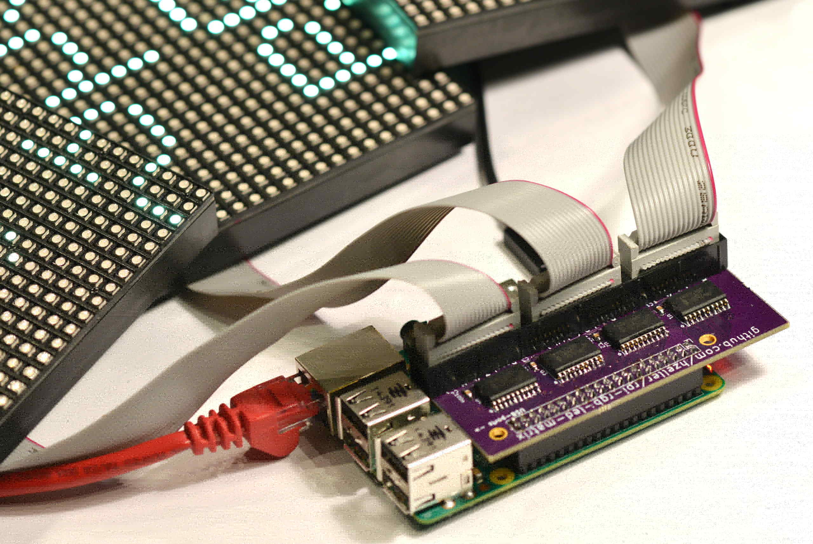

Controlling RGB LED display with Raspberry Pi GPIO
==================================================

A library to control commonly available 32x32 or 16x32 RGB LED panels with the
Raspberry Pi. Can support PWM up to 11Bit per channel, providing true 24bpp
color with CIE1931 profile.

Supports 3 chains with many 32x32-panels each.
On a Raspberry Pi 2, you can easily chain 12 panels in that chain (so 36 panels total),
but you can stretch that to up to 96-ish panels (32 chain length) and still reach
around 100Hz refresh rate with full 24Bit color!
With fewer colors you can control even more, faster.

The LED-matrix **library** is (c) Henner Zeller <h.zeller@acm.org> with
GNU General Public License Version 2.0 <http://www.gnu.org/licenses/gpl-2.0.txt>

The demo-main.cc **example code** using this library is released to the
public domain.

## NOTICE: Wiring change on 2015-07-19

The wiring to connect the RPi and the Hub75 changed on 2015-07-19 to provide
improved output quality.
If you have an existing wiring from an earlier version of this library, provide

    DEFINE+=-DRGB_CLASSIC_PINOUT make

to the compilation to make the old wiring work.
Better yet, consider changing the wiring as it provides a much more stable image. See table below for wiring.

Overview
--------
The 32x32 or 16x32 RGB LED matrix panels can be scored at [Sparkfun][sparkfun],
[AdaFruit][ada] or eBay. If you are in China, I'd try to get them directly
from some manufacturer, Taobao or Alibaba.

The `RGBMatrix` class provided in `include/led-matrix.h` does what is needed
to control these. You can use this as a library in your own projects or just
use the demo binary provided here which provides some useful examples.

Check out the [minimal-example.cc](./minimal-example.cc) to get started using
this library.

All Raspberry Pi versions supported
-----------------------------------

This supports the old Raspberry Pi's Version 1 with 26 pin header and also the
newer B+ models as well as the Raspberry Pi 2 with 40 pins.
The 26 pin models can drive one chain of RGB panels, the 40 pin models
**up to three** chains in parallel (each chain 12 or more panels long).

The Raspberry Pi 2 is faster than older models and sometimes the cabeling
can't keep up with the speed; check out
this [troubleshooting section](#help-some-pixels-are-not-displayed-properly)
what to do.

It is recommended to install an image with a realtime kernel
(for instance [this one][emlid-rt]) to minimize a loaded system having an
influence on the image quality.

Types of Displays
-----------------
There are various types of displays that come all with the same Hub75 connector.
They vary in the way the multiplexing is happening or sometimes they are

Type  | Scan Multiplexing | Program Option  | Remark
-----:|:-----------------:|:----------------|-------
32x32 |  1:16             | -r 32           |
32x64 |  1:16             | -r 32 -c 2      | internally two chained 32x32
16x32 |  1:8              | -r 16           |
?     |  1:4              | -r 8            | (not tested myself)

These can be chained by connecting the output of one panel to the input of
the next panel. You can chain quite a few together.

Connection
----------
You need a separate power supply for the panel. There is a connector for that
separate from the logic connector, typically a big one in the center of the
board. The board requires 5V (double check the polarity: what is printed
on the board is correct - I once got boards with supplied cables that had red
(suggesting `+`) and black (suggesting `GND`) reversed!). This power supply is
used to light the LEDs; plan for ~3.5 Ampere per 32x32 panel.

The connector on the RGB panels is called a Hub75 interface. Each panel
typically has two ports, one is the input and the other is the output to
chain additional panels. Usually an arrow shows which of the connectors is
the input.

Here you see a Hub75 connector to be seen at the bottom of the RGB panel
board including the arrow indicating the input direction:
![Hub 75 interface][hub75-arrow]

Other boards are very similar, but instead of zero-indexed color bits
`R0`, `G0`, `B0`, `R1`, `G1`, `B1`, they start the index with one and name these
`R1`, `G1`, `B1`, `R2`, `G2`, `B2`; the functionality is identical.
![Hub 75 interface][hub75]

Throughout this document, we will use the one-index base, so we will call these
signals `R1`, `G1`, `B1`, `R2`, `G2`, `B2` below.

The `strobe` signals is sometimes also called `latch` or `lat`. We'll call it
`strobe` here.

If you plug an IDC-cable into your RGB panel to the input connector, this is
how the signal positions are on the other end of the cable (imagine the LED
panels somewhere outside the picture on the left); note the notch on the right
side of the connector:
![Hub 75 IDC connector][hub75-idc]

The RPi only has 3.3V logic output level, but the display operated at 5V
interprets these logic levels just fine, just make sure to run a short
cable to the board.
If you do run into glitches or erratic pixels, consider some line-buffering,
e.g. using the [active adapter PCB](./adapter/).
Since we only need output pins on the RPi, we don't need to worry about level
conversion back.

For a single chain of LED-panels, we need 13 IO pins, which fit all in the
header of the old Raspberry Pis. Newer Raspberry Pis have 40 GPIO pins, which
allows us to connect three parallel chains of RGB panels.

For reference, this is how the numbering on the Raspberry Pi looks like:
<a href="img/raspberry-gpio.jpg"></a>

This is the same representation used in the table below, which helps for
visual inspection.

### Wiring diagram

For each of the up to three chains, you have to connect `GND`, `strobe`,
`clock`, `OE-`, `A`, `B`, `C`, `D` to all of these (the `D` line is needed
for 32x32 displays; 32x16 displays don't need it); you find the positions
below (there are more GND pins on the Raspberry Pi, but they are left out
for simplicity).

Then for each panel, there is a set of (R1, G1, B1, R2, G2, B2) that you have
to connect to the corresponding pins that are marked `[1]`, `[2]` and `[3]` for
chain 1, 2, and 3 below.
If you only connect one panel or have one chain, connect it to [1] (:smile:); if you
use parallel chains, add the other [2] and [3].

To make things quicker to navigate visually, each chain is marked with a separate
icon:

`[1]`=:smile:, `[2]`=:boom: and `[3]`=:droplet: ; signals that go to all
chains have all icons.

Connection                        | Pin | Pin |  Connection
---------------------------------:|:---:|:---:|:-----------------------------
                             -    |   1 |   2 | -
             :droplet: **[3] G1** |   3 |   4 | -
             :droplet: **[3] B1** |   5 |   6 | **GND** :smile::boom::droplet:
:smile::boom::droplet: **strobe** |   7 |   8 | **[3] R1** :droplet:
                              -   |   9 |  10 | -
:smile::boom::droplet: **clock**  |  11 |  12 | **OE-**  :smile::boom::droplet:
              :smile:  **[1] G1** |  13 |  14 | -
:smile::boom::droplet:      **A** |  15 |  16 | **B**    :smile::boom::droplet:
                             -    |  17 |  18 | **C**    :smile::boom::droplet:
              :smile:  **[1] B2** |  19 |  20 | -
              :smile:  **[1] G2** |  21 |  22 | **D**    :smile::boom::droplet: (for 32 row matrix, 1:16)
              :smile:  **[1] R1** |  23 |  24 | **[1] R2** :smile:
                             -    |  25 |  26 | **[1] B1** :smile:
                             -    |  27 |  28 | -
              :boom:   **[2] G1** |  29 |  30 | -
              :boom:   **[2] B1** |  31 |  32 | **[2] R1** :boom:
              :boom:   **[2] G2** |  33 |  34 | -
              :boom:   **[2] R2** |  35 |  36 | **[3] G2** :droplet:
              :droplet:**[3] R2** |  37 |  38 | **[2] B2** :boom:
                              -   |  39 |  40 | **[3] B2** :droplet:

In the [adapter/](./adapter) directory, there are some boards that make
the wiring task simpler.

Running
-------
The demo-main.cc has some testing demos. Via command line flags, you can choose
the display type you have (16x32 or 32x32), and how many you have chained.

```
$ make
$ ./led-matrix
Expected required option -D <demo>
usage: ./led-matrix <options> -D <demo-nr> [optional parameter]
Options:
        -r <rows>     : Panel rows. '16' for 16x32 (1:8 multiplexing),
                        '32' for 32x32 (1:16), '8' for 1:4 multiplexing; Default: 32
        -P <parallel> : For Plus-models or RPi2: parallel chains. 1..3. Default: 1
        -c <chained>  : Daisy-chained boards. Default: 1.
        -L            : 'Large' display, composed out of 4 times 32x32
        -p <pwm-bits> : Bits used for PWM. Something between 1..11
        -l            : Don't do luminance correction (CIE1931)
        -D <demo-nr>  : Always needs to be set
        -d            : run as daemon. Use this when starting in
                        /etc/init.d, but also when running without
                        terminal (e.g. cron).
        -t <seconds>  : Run for these number of seconds, then exit.
                        (if neither -d nor -t are supplied, waits for <RETURN>)
        -b <brightnes>: Sets brightness percent. Default: 100.
        -R <rotation> : Sets the rotation of matrix. Allowed: 0, 90, 180, 270. Default: 0.
Demos, choosen with -D
        0  - some rotating square
        1  - forward scrolling an image (-m <scroll-ms>)
        2  - backward scrolling an image (-m <scroll-ms>)
        3  - test image: a square
        4  - Pulsing color
        5  - Grayscale Block
        6  - Abelian sandpile model (-m <time-step-ms>)
        7  - Conway's game of life (-m <time-step-ms>)
        8  - Langton's ant (-m <time-step-ms>)
        9  - Volume bars (-m <time-step-ms>)
        10 - Evolution of color (-m <time-step-ms>)
        11 - Brightness pulse generator
Example:
        ./led-matrix -t 10 -D 1 runtext.ppm
Scrolls the runtext for 10 seconds
```

To run the actual demos, you need to run this as root so that the
GPIO pins can be accessed.

The most interesting one is probably the demo '1' which requires a ppm (type
raw) with a height of 32 pixel - it is infinitely scrolled over the screen; for
convenience, there is a little runtext.ppm example included:

     $ sudo ./led-matrix -D 1 runtext.ppm

Here is a video of how it looks
[![Runtext][run-vid]](http://youtu.be/OJvEWyvO4ro)

There are also two examples [minimal-example.cc](./minimal-example.c) and
[text-example.cc](./text-example.cc) that show use of the API.

The text example allows for some interactive output of text (using a bitmap-font
found in the `fonts/` directory). Even though it is just an example, it can
be useful in its own right. For instance, you can connect to its input with a
pipe and simply feed text from a shell-script or other program that wants to
output something. Let's display the time in blue:

     (while :; do date +%T ; sleep 0.2 ; done) | sudo ./text-example -f fonts/8x13B.bdf -y8 -c2 -C0,0,255

You could connect this via a pipe to any process that just outputs new
information on standard-output every now and then. The screen is filled with
text until it overflows which then clears it. Or sending an empty line explicitly
clears the screen (if you want to display an empty line, just send a space).

![Time][time]


### Image Viewer ###

One of the possibly useful demo applications is an image viewer that
reads all kinds of image formats, including animated gifs. It is not compiled
by default, as you need to install the GraphicsMagick dependencies first:

     sudo aptitude install libgraphicsmagick++1-dev
     make led-image-viewer

Then, you can run it with any common image format, including animated gifs:

    sudo ./led-image-viewer myimage.gif

It also supports the standard options to specify the connected
displays (`-r`, `-c`, `-P`).

Chaining, parallel chains and coordinate system
------------------------------------------------

Displays panels have an input connector, but also have an output port, that
you can connect to the next display in a daisy-chain manner. There is the
flag `-c` in the demo program to give number of displays that are chained.
You end up with a very wide
display (chain * 32 pixels). Longer chains affect the refresh rate negatively,
so if you want to stay above 100Hz with full color, don't chain more than
12 panels.
If you use a PWM depth of 1 bit (`-p`), the chain can be much longer.

The original Raspberry Pis with 26 GPIO pins just had enough connector pins
to drive one chain of LED panels. Newer Raspberry Pis have 40 GPIO pins that
allows to add two additional chains of panels in parallel - the nice thing is,
that this doesn't require more CPU and allows you to keep your refresh-rate high,
because you can shorten your chains.

So with that, we have a couple of parameters to keep track of. The **rows** are
the number of LED rows on a particular module; typically these are 16 for a 16x32
display or 32 for 32x32 displays.

Then there is the **chain length**, which is the number of panels that are
daisy chained together.

Finally, there is a parameter how many **parallel** chains we have connected to
the Pi -- limited to 1 on old Raspberry Pis, up to three on newer Raspberry Pis.

For a single Panel, the chain and parallel parameters are both just one: a single
chain (with no else in parallel) with a chain length of 1.

The `RGBMatrix` class constructor has parameters for number of rows,
chain-length and number of parallel. For the demo programs and the image view,
there are command line options for that: `-r` gives rows,
`-c` the chain-length and `-P` the number of parallel chains.

The coordinate system starts at (0,0) at the top of the first parallel chain,
furthest away from the Pi. The following picture gives an overview of various
parameters and the coordinate system.

![Coordinate overview][coordinates]

<a href="adapter/"></a>

## Remapping coordinates ##
You can as well chain multiple boards together and then arrange them in a
different layout. Say you have 4 displays with 32x32 -- if we chain
them, we get a display 32 pixel high, (4*32)=128 pixel long. If we arrange
the boards in a square, we get a logical display of 64x64 pixels.

For convenience, we should only deal with the logical coordinates of
64x64 pixels in our program: implement a `Canvas`
interface to do the coordinate mapping. Have a look at
`class LargeSquare64x64Canvas` for an example and see how it is delegating to
the underlying RGBMatrix with changed coordinates.

Here is how the wiring would look like:

 In action:
[![PixelPusher video][pp-vid]](http://youtu.be/ZglGuMaKvpY)

Using the API
-------------
While there is the demo program, the matrix code can be used independently as
a library. The includes are in `include/`, the library to link is built
in `lib/`. So if you are proficient in C++, then use it in your code.

Due to the wonders of github, it is pretty easy to be up-to-date.
I suggest to add this code as a sub-module in your git repository. That way
you can use that particular version and easily update it if there are changes:

     git submodule add https://github.com/hzeller/rpi-rgb-led-matrix.git matrix

(Read more about how to use [submodules in git][git-submodules])

This will check out the repository in a subdirectory `matrix/`.
The library to build would be in directory `matrix/lib`, so let's hook that
into your toplevel Makefile.
I suggest to set up some variables like this:

     RGB_INCDIR=matrix/include
     RGB_LIBDIR=matrix/lib
     RGB_LIBRARY_NAME=rgbmatrix
     RGB_LIBRARY=$(RGB_LIBDIR)/lib$(RGB_LIBRARY_NAME).a
     LDFLAGS+=-L$(RGB_LIBDIR) -l$(RGB_LIBRARY_NAME) -lrt -lm -lpthread

Also, you want to add a target to build the libary in your sub-module

	 # (FYI: Make sure, there is a TAB-character in front of the $(MAKE))
     $(RGB_LIBRARY):
		 $(MAKE) -C $(RGB_LIBDIR)

Now, your final binary needs to depend on your objects and also the
`$(RGB_LIBRARY)`

     my-binary : $(OBJECTS) $(RGB_LIBRARY)
	     $(CXX) $(CXXFLAGS) $(OBJECTS) -o $@ $(LDFLAGS)

As an example, see the [PixelPusher implementation][pixelpush] which is using
this library in a git sub-module.

If you are writing your own Makefile, make sure to pass the `-O3` option to
the compiler to make sure to generate fast code.

Note, all the types provided are in the `rgb_matrix` namespace. That way, they
won't clash with other types you might use in your code; in particular pretty
common names such as `GPIO` or `Canvas` might run into clashing trouble.

Anyway, for convenience you just might add using-declarations in your
code:

     // Types exported by the RGB-Matrix library.
     using rgb_matrix::Canvas;
     using rgb_matrix::GPIO;
     using rgb_matrix::RGBMatrix;
     using rgb_matrix::ThreadedCanvasManipulator;

Or, if you are lazy, just import the whole namespace:

     using namespace rgb_matrix;

Read the [`minimal-example.cc`](./minimal-example.cc) to get started, then
have a look into [`demo-main.cc`](./demo-main.cc).

Help, some pixels are not displayed properly
--------------------------------------------
Some panels don't handle the 3.3V logic level well, or the RPi output drivers
have trouble driving longer cables, in particular with
faster Raspberry Pis Version 2. This results in artifacts like randomly
showing up pixels, color fringes, or parts of the panel showing 'static'.

If you encounter this, try these things

   - Make sure to have as short as possible flat-cables connecting your
     Raspberry Pi with the LED panel.

   - Use an adapter board with a bus-driver that acts as level shifter between
     3.3V and 5V. You can find [active adapter PCBs](./adapter/) in a
     subdirectory of this project.

   - If you can't implement the above things, or still have problems, you can
     slow down the GPIO writing a bit. This will of course reduce the
     frame-rate, so it comes at a cost.

For GPIO slow-down, uncomment the following line in [lib/Makefile](lib/Makefile)

     #DEFINES+=-DRGB_SLOWDOWN_GPIO   # remove '#' in the beginning

Then `make` again.

Inverted Colors ?
-----------------
There are some displays out there that use inverse logic for the colors. You
notice that your image looks like a 'negative'. In that case, uncomment the
folling `DEFINES` line in [lib/Makefile](./lib/Makefile) by removing the `#`
at the beginning of the line.

     #DEFINES+=-DINVERSE_RGB_DISPLAY_COLORS   # remove '#' in the beginning

Then, recompile

     make

A word about power
------------------

These displays suck a lot of current. At 5V, when all LEDs are on (full white),
my LED panel draws about 3.4A. That means, you need a beefy power supply to
drive these panels; a 2A USB charger or similar is not enough for a
32x32 panel; it might be for a 16x32.

If you connect multiple boards together, you needs a power supply that can
keep up with 3.5A / panel. Good are old PC power supplies that often
provide > 20A on the 5V rail. Also you can get dedicated 5V high current
switching power supplies for these kind of applications (check eBay).

The current draw is pretty spiky. Due to the PWM of the LEDs, there are very
short peaks of a couple of 100ns to about 1ms of full current draw.
Often, the power cable can't support these very short spikes due to inherent
inductance. This can result in 'noisy' outputs, with random pixels not behaving
as they should. A low ESR capacitor close to the input is good in these cases.

On some displays, the quality of the output quickly gets erratic
when voltage drops below 4.5V. Some even need a little bit higher voltage around
5.5V to work reliably.

When you connect these boards to a power source, the following are good
guidelines:
   - Have fairly thick cables connecting the power to the board.
     Plan not to loose more than 50mV from the source to the LED matrix.
     So that would be 50mV / 3.5A = 14 mΩ. For both supply wires, so 7mΩ
     each trace.
     A 1mm² copper cable has about 17.5mΩ/meter, so you'd need a **2.5mm²
     copper cable per meter and panel**. Multiply by meter and number of
     panels to get the needed cross-section.
     (For Americans: that would be ~13 gauge wire for 3 ft and one panel)

   - You might consider using aluminum mounting brackets or bars as part of
     your power trace solution. With aluminum of 1mm² specific resistivity of
     about 28mΩ/meter, you'd need a cross sectional area of about 4mm² per panel
     and meter.

   - These are the minimum values to not drop more than 50mV. As engineer, you'd
     like to aim for less than that :)

   - Often these boards come with connectors that have cables crimped on.
     These cables are typically too thin; you might want to clip them close to
     the connector solder your proper, thick cable to it.

   - It is good to buffer the current spikes directly at the panel. The most
     spikes happen while PWM-ing a single line.
     So let's say we want to buffer the energy to power a single line without
     dropping more than 50mV. We use 3.5A which is 3.5Joule/second. We do
     about 140Hz refresh rate and divide that in 16 lines, so we need
     3.5 Joule/140/16 = ~1.6mJoule in the time period to display one line.
     We want to get the energy out of the voltage drop of 50mV; so with
     W = 1/2*C*U², we can calculate the capacitance needed:
       C = 2 * 1.6mJoule / ((5V)² - (5V - 50mV)²) = ~6400µF.
     So, **2 x 3300µF** low-ESR capacitors in parallel directly
     at the board are a good choice (two, because lower parallel ESR; also
     fits easier under board).
     (In reality, we need of course less, as the highest ripple comes with
      50% duty cyle thus half the current; also the input is recharching all
      the time. But: as engineer plan for maximum and then some).

   - If you still see noise, increase the voltage sligthly above 5V. But note,
     this is typically only a symptom of too thin traces.

Now welcome your over-engineered power solution :)

Technical details
-----------------

The matrix modules available on the market all seem to have the same
standard interface, essentially controlling
two banks of 16 rows (0..15 and 16..31) There are always two rows (n and n+16),
that are controlled in parallel
(These displays are also available in 16x32; in that case, it is two banks of 8).

The data for each row needs to be clocked in serially using one bit for red,
green and blue for both rows that are controlled in parallel (= 6 bits), then
a positive clock edge to shift them in - 32 pixels for one row are clocked in
like this (or more: you can chain these displays).
With 'strobe', the data is transferred to the output buffers for the row.
There are four bits that select the current row(-pair) to be displayed.

Then, with 'output enable', we switch the LEDs on for the amount of time for
that bit plane. This is using some hardware support from the Pi to generate
precise timings (but not if you use an old pinout).

Since LEDs can only be on or off, we have to do our own PWM by constantly
clocking in pixels.

**CPU use**

These displays need to be updated constantly to show an image with PWMed
LEDs. This is dependent on the length of the chain: for each chain element,
about 1'000'000 write operations have to happen every second!
(chain_length * 32 pixel long * 16 rows * 11 bit planes * 180 Hz refresh rate).

We can't use hardware support for writing these as DMA is too slow,
thus the constant CPU use on an RPi is roughly 30-40%.
Keep that in mind if you plan to run other things on this computer (This
is less noticable on Raspberry Pi, Version 2 that has more cores).

Also, the output quality is suceptible to other heavy tasks running on that
computer - there might be changes in the overall brigthness when this affects
the referesh rate. In general, it is a good idea to use a Linux kernel with
realtime extensions.

Limitations
-----------
If you are using the RGB_CLASSIC_PINOUT, then we can't make use of the PWM
hardware (which only outputs to a particular pin), so you'll see random
brightness glitches. I strongly suggest to change to the now default pinout.

The system needs constant CPU to update the display. Using the DMA controller
was considered but after extensive experiments
( https://github.com/hzeller/rpi-gpio-dma-demo )
dropped due to its slow speed..

There is an upper limit in how fast the GPIO pins can be controlled, which
limits the frame-rate. Raspberry Pi 2's are generally faster.

Fun
---
I am always happy to see users successfully using the software for wonderful
things, like this installation by Dirk in Scharbeutz, Germany:


[hub75]: ./img/hub75.jpg
[hub75-arrow]: ./img/hub75-other.jpg
[hub75-idc]: ./img/idc-hub75-connector.jpg
[matrix64]: ./img/chained-64x64.jpg
[coordinates]: ./img/coordinates.png
[time]: ./img/time-display.jpg
[pp-vid]: ./img/pixelpusher-vid.jpg
[run-vid]: ./img/running-vid.jpg
[pixelpush]: https://github.com/hzeller/rpi-matrix-pixelpusher
[sparkfun]: https://www.sparkfun.com/products/12584
[ada]: http://www.adafruit.com/product/1484
[git-submodules]: http://git-scm.com/book/en/Git-Tools-Submodules
[emlid-rt]: http://docs.emlid.com/Downloads/Real-time-Linux-RPi2/
[rt-paper]: https://www.osadl.org/fileadmin/dam/rtlws/12/Brown.pdf
