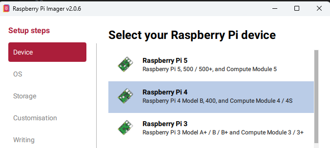
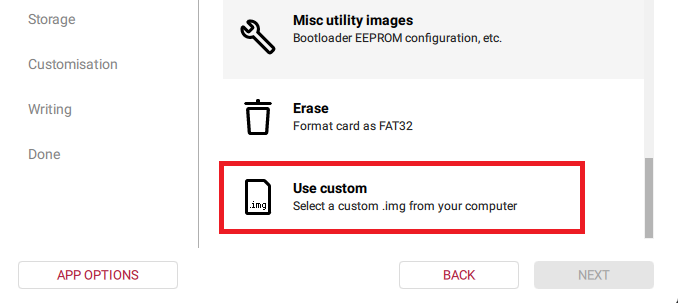
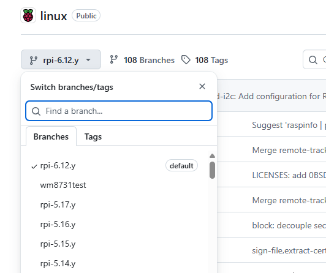
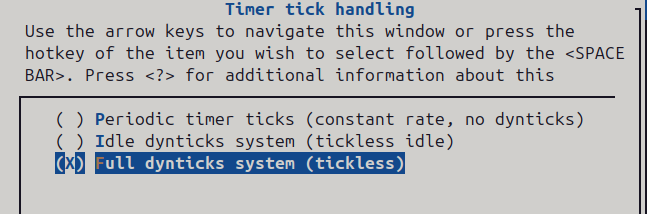
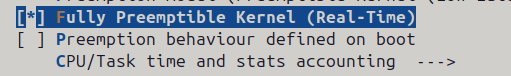

# Real Time Kernel

If you are using SPWM displays or normal displays without the PWM hardware modification; to help with flickering it is highly recommended to flash this optimized kernel.

First perform the below **cmdline.txt** modification, this also helps with intermittent flicker especially when combined with the real time kernel as guided below. Apply this regardless of using RT kernel or not, as it helps with interrupts on Core 3 which is what the library uses to refresh the display.
```
nano /boot/firmware/cmdline.txt

# Add to the end of the line
isolcpus=domain,managed_irq,2,3 nohz_full=2,3 rcu_nocbs=2,3 irqaffinity=0,1 idle=poll
```
---

[Option 1 - Download Preinstalled Image - Pi 4 / 3 / Zero 2W - Trixie 64-bit Lite](#option-1---download-preinstalled-trixie-image---64-bit-lite)

[Option 2 - Copy RT Kernel To Your Current Raspberry OS installation](#option-2---copy-rt-kernel-to-your-current-raspberry-os-installation)

[Option 3 - Compile and Apply Your Own Raspberry Real Time Kernel](#option-3---compile-and-install-your-own-raspberry-real-time-kernel)

[Recommended Performance Mods](#performance-mods)

---

<br>

## Option 1 - Download Preinstalled Trixie Image - 64-bit Lite

Full image with Hzeller library installed + RT Kernel.

<a href="https://mega.nz/file/GIV3GDLT#iKld0ksdm9_DLyfXxmwsLUGSX-MUSiR_OlDA7YLemrM">Raspberry Pi 4 Lite Trixie 64-Bit - RT Kernel Preinstalled image</a>

Raspberry Pi 3 Trixie 64-Bit - RT Kernel Preinstalled image (update soon)</a>

<a href="https://mega.nz/file/GMEi3TjL#mWLY3-WOkyQ61l7Npd5_LRvrowKYY6kGFY_AdX-o8H4">Raspberry Pi Zero 2W Lite Trixie 64-Bit - RT Kernel Preinstalled image</a>
<br><br>
**Note: first boot can take a moment to unpack image to the size of your SD card**

To access via SSH, either use Ethernet / USB Ethernet. \
user / password \
Then if you need to set up Wi-Fi, use the command - **nmtui**

Alternatively, set up a Wi-Fi hotspot on your phone using the details \
Raspberry / password1 \
Then SSH from your phone to the connected Raspberry device. Android will show the IP of the connected device to the Hotspot when clicking (i) \
Again use **nmtui** to change or remove the Wi-Fi connection.






---
## Option 2 - Copy RT Kernel To Your Current Raspberry OS installation

**This precompiled kernel is for Raspberry Pi 4 / 3 / Zero 2W - 64-bit. Alternatively [compile your own](#option-3---compile-and-install-your-own-raspberry-kernel)**

Download and copy the below kernel files to your Raspberry Pi in the /tmp directory.

The kernel version compiled is 6.18.18-rt
So its best your OS image is already close to it.

[raspberry_kernel_rt_trixie_042126_v3_boot.tar.gz](./raspberry_kernel_rt_trixie_042126_v3_boot.tar.gz)

[raspberry_kernel_rt_trixie_042126_v3_root.tar.gz](./raspberry_kernel_rt_trixie_042126_v3_root.tar.gz)


```
tar -xzf /tmp/raspberry_kernel_rt_trixie*boot.tar.gz -C /boot/firmware
tar -xzf /tmp/raspberry_kernel_rt_trixie*root.tar.gz -C /
```

Reboot and check your kernel reads
```
uname -a
Linux raspberry 6.18.18-rt-v8+ #1 SMP PREEMPT_RT
```
###########################################################

**Optionally if you are not already using a similar Trixie image**, if your original kernel was much older and encounter issues with Wi-Fi, you may need to perform the additional step to match your images firmware.

You may only need the below to fix it 
```
apt-get update; apt-get install --reinstall firmware-brcm80211
```
Alternatively if using Pi 4, extract it from below. \
Kernel firmware \
[raspberry4_kernel_rt_trixie_042126_firmware.tar.gz](https://mega.nz/file/DdN3wAZK#FCYCSCuUvn7_p_8c8e-fSeSyJwL5Fm1Wim2NqbAF8q4)

```
tar -xzf /tmp/raspberry4_kernel_rt_trixie_*_firmware.tar.gz -C /
```
Depending on what your original kernel/os image was, you may see some dmesg prompts like the below which should be fine.

```
42.834070] rcu: INFO: rcu_preempt self-detected stall on CPU
42.834101] rcu: $3-....: (3 GPs behind) idle=7d5c/1/0x4000000000000000 softirq=0/0 f
491 rcuc=5301 jiffies (starved)
42.834124] rcu: t = 525theta jiffies g = 3129 alpha = 2711 ncpus=4) 105.845757] rcu: INFO: rcu_preempt self-detected stall on CPU
105.845787] rcu: $3-....: (3 GPs behind) idle=7d5c/1/0x4000000000000000 softirq=0/0 f
915 rcuc=21054 jiffies (starved)
```
<br>


---
## Option 3 - Compile and Install Your Own Raspberry Real Time Kernel
 Install and start Raspberry OS, I'm using Trixie Lite 64-bit
 Find the kernel version of your current Raspberry Pi install.

```
uname -a
```
<span style="color:darkred;font-weight:bold">
 Using a Desktop Ubuntu Linux system, currently using Ubuntu 24.0 - To cross compile

</span>

```
apt install -y bc bison flex libssl-dev make libc6-dev libncurses-dev libelf-dev crossbuild-essential-arm64 git
cd /home/user/
mkdir kernel
cd kernel
git clone https://github.com/raspberrypi/linux.git
cd linux
```
 <br>

 **OPTIONAL** - Below will show the current kernel version currently checked out. Run the below to change kernel version by using git checkout. To find kernel version branches available, navigate to https://github.com/raspberrypi/linux
```
head -n 4 Makefile
git checkout rpi-6.18.y
```


<br><br><br>
 
 **Set the Kernel variable where kernel8 as being  Pi 4 / 3 / Zero 2W | Other references link
https://www.raspberrypi.com/documentation/computers/linux_kernel.html**

```
KERNEL=kernel8
```

 **Make default config, my example as Pi 4 / 3 / Zero 2W**
```
make KERNEL=kernel8 ARCH=arm64 CROSS_COMPILE=aarch64-linux-gnu- bcm2711_rt_defconfig
```

 **Other Config examples below.**

 **64-bit (ARCH=arm64)**
 
 Pi 3 / 3+ / CM3 / CM3+ / Zero 2 W / Pi 4 / Pi 400 / CM4 / CM4S -  `bcm2711_rt_defconfig`
 
 Pi 5 / Pi 500 / CM5 - `bcm2712_rt_defconfig`

 **32-bit (ARCH=arm)**

 Pi 1 / CM1 / Zero / Zero W / Pi 2 - `bcmrpi_rt_defconfig`

 Pi 3 / 3+ / CM3 / CM3+ / Zero 2 W - `bcm2709_rt_defconfig`

 **Note: Raspberry Pi OS 32-bit on Pi 4 class devices normally uses a 64-bit kernel by default; building a true 32-bit kernel for those needs ARCH=arm and extra boot config.**

<br>

 **Edit Kernel options**

```
# nano - CTRL+S | CTRL+X - Save and Quit

# Disabling Wi-Fi power saving by default - equivalent to /sbin/iwconfig wlan0 power off
nano include/net/cfg80211.h
WIPHY_FLAG_PS_ON_BY_DEFAULT = 0
---------------------------------------------

# Options to remove and unnecessary overhead
# Search with CTRL+W and edit, or paste the below block at the bottom.

nano .config

CONFIG_B43LEGACY_DEBUG=n
CONFIG_BSD_PROCESS_ACCT=n
CONFIG_BSD_PROCESS_ACCT_V3=n
CONFIG_CFG80211_DEFAULT_PS=n
CONFIG_CHECKPOINT_RESTORE=n
CONFIG_DEBUG_FS=n
CONFIG_DEBUG_MISC=n
CONFIG_FTRACE=n
CONFIG_HOTPLUG_CPU=n
CONFIG_KGDB=n
CONFIG_KGDB_KDB=n
CONFIG_KPROBES=n
CONFIG_LATENCYTOP=n
CONFIG_NETFILTER_XT_TARGET_AUDIT=n
CONFIG_OSNOISE_TRACER=n
CONFIG_PERF_EVENTS=n
CONFIG_PM_DEBUG=n
CONFIG_PROFILING=n
CONFIG_PSI=n
CONFIG_RCU_TRACE=n
CONFIG_RTLWIFI_DEBUG=n
CONFIG_SCHEDSTATS=n
CONFIG_SCHED_AUTOGROUP=n
CONFIG_SCHED_TRACER=n
CONFIG_SLUB_DEBUG=n
CONFIG_STACK_TRACER=n
CONFIG_TASKSTATS=n
CONFIG_TASK_DELAY_ACCT=n
CONFIG_TASK_IO_ACCOUNTING=n
CONFIG_TASK_XACCT=n
CONFIG_TIMERLAT_TRACER=n
CONFIG_TRACING=n
```
---

**Pi 3 / Zero 2W - Additional Step**
This chipset needs an additional change to reduce interrupts when checking with cat /proc/interrupts.

Changes based on kernel 6.18 - Should be similar on others.
Just replace the functions


<br>
drivers/irqchip/irq-bcm2836.c
<br><br>

```

#include <linux/kernel.h>

--------------------------------

void bcm2836_arm_irqchip_spin_gpu_irq(void)
{
	static const u32 gpu_irq_cpus[] = { 0, 1 };
	static DEFINE_RAW_SPINLOCK(gpu_route_lock);
	unsigned long flags;
	u32 i;
	u32 irq_route;
	u32 fiq_bits;
	void __iomem *gpurouting = intc.base + LOCAL_GPU_ROUTING;
	u32 routing_val;

	raw_spin_lock_irqsave(&gpu_route_lock, flags);

	routing_val = readl(gpurouting);
	irq_route = routing_val & 0x3;
	fiq_bits = routing_val & ~0x3;

	/* Keep GPU IRQs on cores 0/1 so cores 2/3 stay free. */
	for (i = 0; i < ARRAY_SIZE(gpu_irq_cpus); i++) {
		u32 next = gpu_irq_cpus[(irq_route + 1 + i) %
					 ARRAY_SIZE(gpu_irq_cpus)];

		if (cpu_active(next)) {
			writel(fiq_bits | next, gpurouting);

			/* Flush posted write so next IRQ sees the new route */
			readl(gpurouting);

			raw_spin_unlock_irqrestore(&gpu_route_lock, flags);
			return;
		}
	}

	raw_spin_unlock_irqrestore(&gpu_route_lock, flags);
}

```

---


```
make KERNEL=kernel8 ARCH=arm64 CROSS_COMPILE=aarch64-linux-gnu- menuconfig
```
``` 
General Setup > Timers Subsystem > Timer tick handling > Full dynticks system (tickless)
Ensure General Setup > Fully Preemptible Kernel (Real-Time)
Ensure General Setup > Preemption Model - Low-Latency Desktop

Save
Exit
```

<br>
<br><br>

```
make -j"$(nproc)" KERNEL=kernel8 ARCH=arm64 CROSS_COMPILE=aarch64-linux-gnu- Image.gz modules dtbs
```

 **Now we copy the relevant files to the Raspberry OS sdcard.**
 **Use SD card reader to attach sdcard to Ubuntu system.**
 **In the console, find the mountpoints of the sdcard.**
```
mount | grep /dev/sd
```
 **Example**
```
/media/user/bootfs
/media/user/rootfs
```

 **Making sure you are still in the current working directory e.g**
```
cd /home/user/kernel/linux
```

 **Backup existing Kernel and related files**
```
cp /media/user/bootfs/${KERNEL}.img /media/user/bootfs/${KERNEL}.bak
mkdir -p /media/user/bootfs/dtbbak
mkdir -p /media/user/bootfs/overlays/dtboverlaysbak
cp /media/user/bootfs/*.dtb /media/user/bootfs/dtbbak
cp /media/user/bootfs/overlays/*.dtb* /media/user/bootfs/overlays/dtboverlaysbak
```

 **Copy the RT Kernel to the sdcard**
```
cp arch/arm64/boot/Image.gz /media/user/bootfs/${KERNEL}.img
cp arch/arm64/boot/dts/broadcom/*.dtb /media/user/bootfs
cp arch/arm64/boot/dts/overlays/*.dtb* /media/user/bootfs/overlays
sudo make ARCH=arm64 CROSS_COMPILE=aarch64-linux-gnu- INSTALL_MOD_PATH=/media/user/rootfs modules_install
sync
```

 **Add the Kernel parameters for RT at the end of the line - CTRL+S , CTRL+X to save in nano**
```
nano /media/user/bootfs/cmdline.txt

# Add this to the end of the line
isolcpus=domain,managed_irq,2,3 nohz_full=2,3 rcu_nocbs=2,3 irqaffinity=0,1 idle=poll

```

 **Put the sdcard back into the Pi and boot**
 **Confirm Real Time kernel is now installed**

```
uname -a
```

---


## Performance Mods

CTRL+S , CTRL+X to Save and Exit from Nano


```
nano /etc/rc.local

#!/bin/sh -e
echo performance > /sys/devices/system/cpu/cpufreq/policy0/scaling_governor
echo 3 > /sys/devices/virtual/workqueue/cpumask
exit 0

---- Save

chmod +x /etc/rc.local
reboot
```
<br>

Force turbo, disabling CPU frequency changes

```
nano /boot/firmware/config.txt

# Add
force_turbo=1
```
<br>

When running the library, even though the display refresh thread uses Core 3 automatically, I also assign the parent process to Core 2 and set the priority using:

```
taskset -c 2 chrt -f 99 /opt/rpi-rgb-led-matrix/examples-api-use/demo -D8 --led-rows=64 --led-cols=128 --led-limit-refresh=60 --led-no-busy-waiting ....
```
<br>


Original discussion thread
https://github.com/hzeller/rpi-rgb-led-matrix/issues/1754

