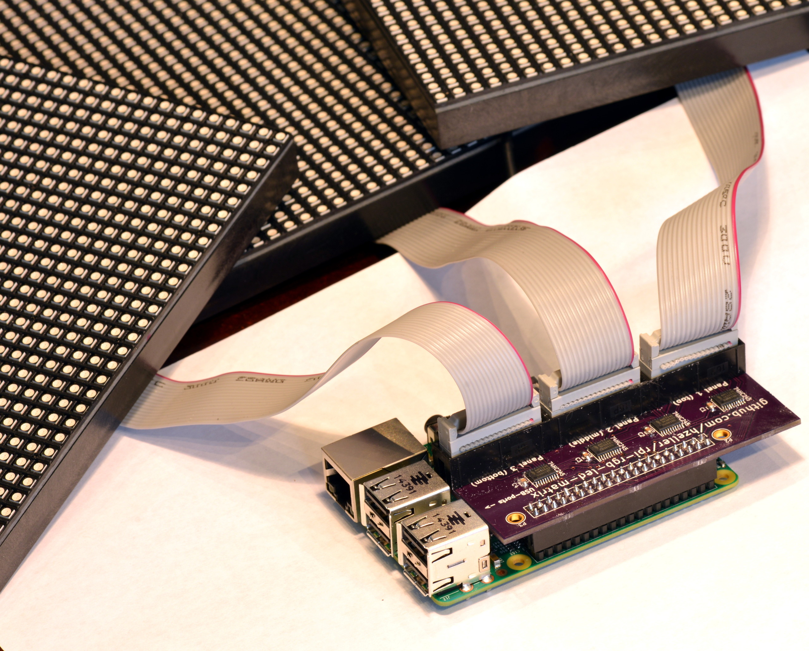

PCB adapter for Raspberry Pi to Hub75 RGB Matrixes
==================================================

Since hand-wiring can be a little tedious, here are some PCBs that help
with the wiring when using the `rpi-rgb-led-matrix` code.

   * [Passive](./passive) is the simplest one, directly wiring the GPIO pins
     to the Hub75 IDC connectors for up to two parallel chains (for
     40 GPIO pin Raspberry Pis. Older 26 GPIO pin Raspberry Pis can connect
     to one chain).
   * [Active](./active) Similar to the passive PCB, but does level
     shifting 3.3V -> 5V and provides convenient breakouts for I²C and serial.
   * [Active3](./active-3) Like the active board, but supports three parallel
      chains with level shifting. Due to the additional amount of GPIO pins
      needed, I²C and serial can't be used (work in progress).

