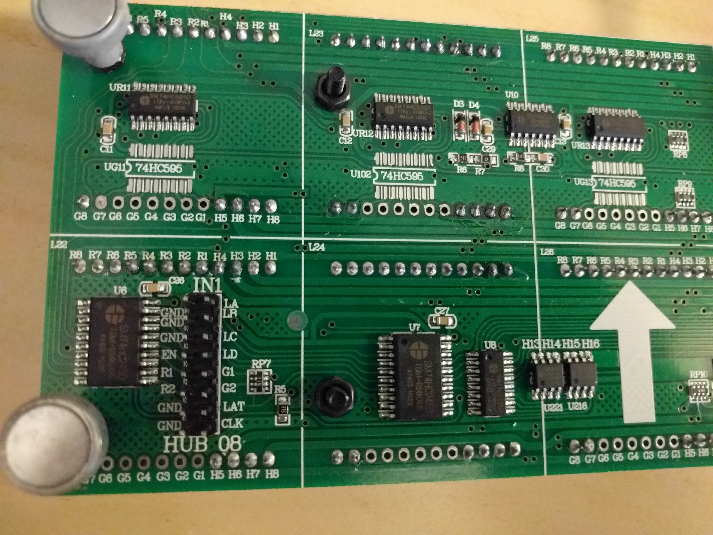

Adapter PCB to support up to 2 panel chains
===========================================

   * This adapter is designed specifically for 16x64 LED matrix boards that use a non standard pin layout
 
   * This is a passive board. It is simple, but the logic level will be out of
     spec for the LED matrix (3.3V vs. 5V) which might or might not work.
     Driving long cables with the GPIO pins is also not a good idea.
   * Only really advisable, if the LED panels have 74HCT245 (as opposed to just
     74HC245) in their input stage, because then they can deal properly with
     the 3.3V logic levels coming from the Pi.
   * Open source KiCAD PCB EDA format.
   * autorouted 
   * The FAB files are provided as [passive2-rpi-non-standard-adapter-fab.zip](./passive2-rpi-non-standard-adapter-fab.zip)

This board is [shared on OSH Park][osh-passive3] (not affiliated).

![Preview][rendering]

[rendering]: ../../img/passive2-rpi-non-standard-adapter.png

[osh-passive3]: https://oshpark.com/shared_projects/LxM7tyyO