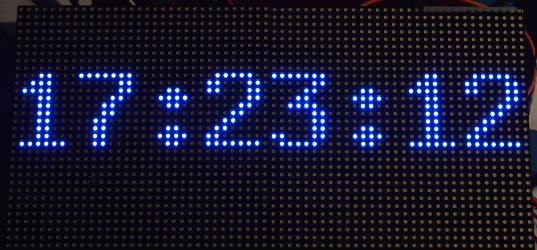
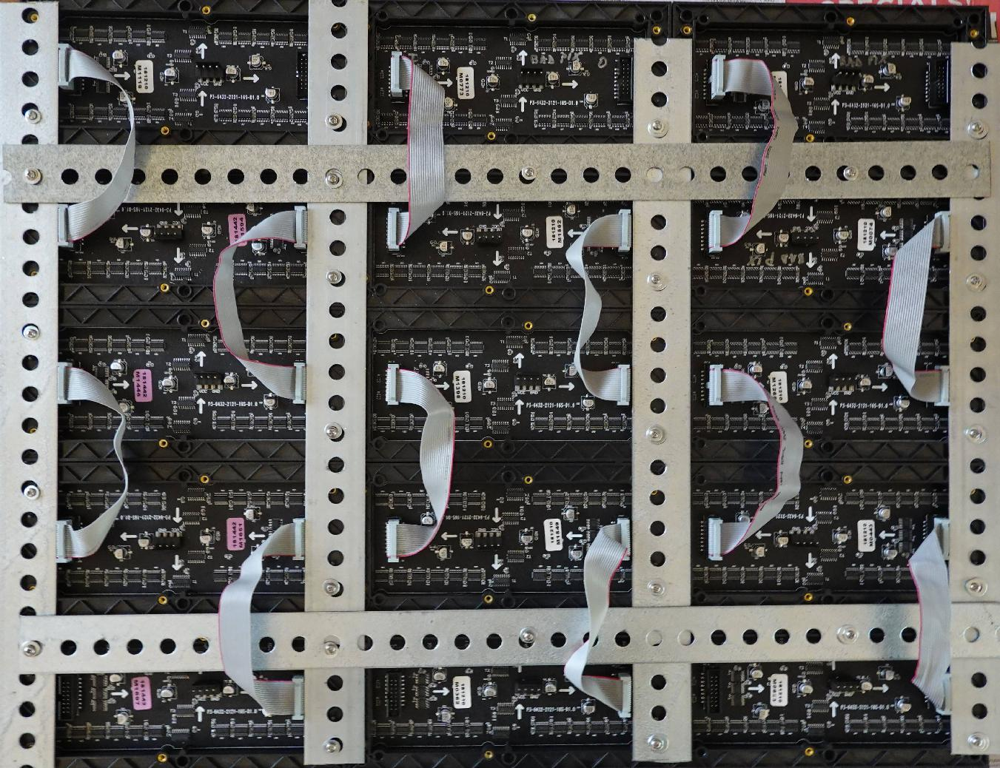

Running some demos
------------------
Let's start by running some demos, then we can dive into code. The
[demo-main.cc](demo-main.cc) has some testing demos. Via command line flags,
you can choose the display type you have (16x32 or 32x32), and how many you
have chained and paralleled. For detailed description of these flags see the
[main README section](../README.md#changing-parameters-via-command-line-flags)
about it.

```
$ make
$ sudo ./demo
usage: ./demo <options> -D <demo-nr> [optional parameter]
Options:
        -D <demo-nr>              : Always needs to be set
        --led-gpio-mapping=<name> : Name of GPIO mapping used. Default "regular"
        --led-rows=<rows>         : Panel rows. Typically 8, 16, 32 or 64. (Default: 32).
        --led-cols=<cols>         : Panel columns. Typically 32 or 64. (Default: 32).
        --led-chain=<chained>     : Number of daisy-chained panels. (Default: 1).
        --led-parallel=<parallel> : Parallel chains. range=1..3 (Default: 1).
        --led-multiplexing=<0..17> : Mux type: 0=direct; 1=Stripe; 2=Checkered; 3=Spiral; 4=ZStripe; 5=ZnMirrorZStripe; 6=coreman; 7=Kaler2Scan; 8=ZStripeUneven; 9=P10-128x4-Z; 10=QiangLiQ8; 11=InversedZStripe; 12=P10Outdoor1R1G1-1; 13=P10Outdoor1R1G1-2; 14=P10Outdoor1R1G1-3; 15=P10CoremanMapper; 16=P8Outdoor1R1G1; 17=FlippedStripe (Default: 0)
        --led-pixel-mapper        : Semicolon-separated list of pixel-mappers to arrange pixels.
                                    Optional params after a colon e.g. "U-mapper;Rotate:90"
                                    Available: "Mirror", "Rotate", "U-mapper", "V-mapper". Default: ""
        --led-pwm-bits=<1..11>    : PWM bits (Default: 11).
        --led-brightness=<percent>: Brightness in percent (Default: 100).
        --led-scan-mode=<0..1>    : 0 = progressive; 1 = interlaced (Default: 0).
        --led-row-addr-type=<0..4>: 0 = default; 1 = AB-addressed panels; 2 = direct row select; 3 = ABC-addressed panels; 4 = ABC Shift + DE direct (Default: 0).
        --led-show-refresh        : Show refresh rate.
        --led-limit-refresh=<Hz>  : Limit refresh rate to this frequency in Hz. Useful to keep a
                                    constant refresh rate on loaded system. 0=no limit. Default: 0
        --led-inverse             : Switch if your matrix has inverse colors on.
        --led-rgb-sequence        : Switch if your matrix has led colors swapped (Default: "RGB")
        --led-pwm-lsb-nanoseconds : PWM Nanoseconds for LSB (Default: 130)
        --led-pwm-dither-bits=<0..2> : Time dithering of lower bits (Default: 0)
        --led-no-hardware-pulse   : Don't use hardware pin-pulse generation.
        --led-panel-type=<name>   : Needed to initialize special panels. Supported: 'FM6126A', 'FM6127'
        --led-slowdown-gpio=<0..4>: Slowdown GPIO. Needed for faster Pis/slower panels (Default: 1).
        --led-daemon              : Make the process run in the background as daemon.
        --led-no-drop-privs       : Don't drop privileges from 'root' after initializing the hardware.
Demos, choosen with -D
        0  - some rotating square
        1  - forward scrolling an image (-m <scroll-ms>)
        2  - backward scrolling an image (-m <scroll-ms>)
        3  - test image: a square
        4  - Pulsing color
        5  - Grayscale Block
        6  - Abelian sandpile model (-m <time-step-ms>)
        7  - Conway's game of life (-m <time-step-ms>)
        8  - Langton's ant (-m <time-step-ms>)
        9  - Volume bars (-m <time-step-ms>)
        10 - Evolution of color (-m <time-step-ms>)
        11 - Brightness pulse generator
Example:
        ./demo -D 1 runtext.ppm
Scrolls the runtext until Ctrl-C is pressed
```

To run the actual demos, you need to run this as root so that the
GPIO pins can be accessed; as soon as that established, the program will drop
the privileges.

Here is how demo '1' looks. It requires a ppm (type raw) with a height of
32 pixel - it is infinitely scrolled over the screen; for
convenience, there is a little runtext.ppm example included:

     $ sudo ./demo -D 1 runtext.ppm

Here is a video of how it looks
[![Runtext][run-vid]](http://youtu.be/OJvEWyvO4ro)

Other Examples
--------------

There are a few other examples that you can use as starting point for your
own exploration of the API. If you just type `make` in this directory, the
Makefile will build all of these, so they are ready to use. Some examples
need BDF fonts, of which there are a few provided in [../fonts](../fonts).

Some of these example programs are described in more detail further down this
page.

 * [minimal-example](./minimal-example.cc) Good to get started with the API
 * [image-example](./image-example.cc) How to show an image (requires to install the graphics magic library, see in the header of that demo)
 * [text-example](./text-example.cc) Reads text from stdin and displays it.
 * [scrolling-text-example](./scrolling-text-example.cc) Scrolls a text
   given on the command-line.
 * [clock](./clock.cc) Shows a clock with choosable date format string in
   one or multiple lines.
 * [input-example](./input-example.cc) Example how to use the LED-Matrix but
   also read inputs from free GPIO-pins. Needed if you build some interactive
   piece.
 * [ledcat](./ledcat.cc) LED-cat compatible reading of pixels from stdin.
 * [pixel-mover](./pixel-mover.cc) Displays pixel on the display
   and it's expected position on the terminal. Helpful for testing panels and
   figuring out new multiplexing mappings.
   Shows single dot or leaves a trail with length passed with `-t` option
   (think of 'snake').
   Can move around the pixel with W=Up, S=Down, A=Left, D=Right keys.

Using the API
-------------
While there is the demo program and the [utilities](../utils), this code can
be used independently as a library to be used in your own programs.
The includes are in `include/`, the library to link is built
in `lib/`. This is a C++ also with C bindings. There is also a
[Python](../bindings/python) and [c#](../bindings/c%23) bindings.

Getting started
---------------
The relevant part to start with is to look at
[led-matrix.h](../include/led-matrix.h).

You can would typically use the `RGBMatrix::CreateFromFlags()` factory to
create an RGBMatrix and then go from there.

```C++
#include "led-matrix.h"

using rgb_matrix::RGBMatrix;

int main(int argc, char **argv) {
  // Set some defaults
  RGBMatrix::Options my_defaults;
  my_defaults.hardware_mapping = "regular";  // or e.g. "adafruit-hat" or "adafruit-hat-pwm"
  my_defaults.chain_length = 3;
  my_defaults.show_refresh_rate = true;
  rgb_matrix::RuntimeOptions runtime_defaults;
  // If you drop privileges, the root user you start the program with
  // to be able to initialize the hardware will be switched to an unprivileged
  // user to minimize a potential security attack surface.
  runtime_defaults.drop_privileges = 1;
  RGBMatrix *matrix = RGBMatrix::CreateFromFlags(&argc, &argv,
                                                 &my_defaults,
                                                 &runtime_defaults);
  if (matrix == NULL) {
    PrintMatrixFlags(stderr, my_defaults, runtime_defaults);
    return 1;
  }

  // matrix->ApplyPixelMapper(...);  // Optional

  // Do your own command line handling with the remaining options.

  //  .. now use matrix

  delete matrix;   // Make sure to delete it in the end.
}
```

The `RGBMatrix` is essentially a canvas, it provides some basic functionality
such as `SetPixel()`, `Fill()` or `Clear()`. If you want to do more, you
might be interested in functions provided in the
[graphics.h](../include/graphics.h) header.

If you have animations, you might be interested in double-buffering. There is
a way to create new canvases with `CreateFrameCanvas()`, and then use
`SwapOnVSync()` to change the content atomically. See API documentation for
details.

Start with the [minimal-example.cc](./minimal-example.cc) to start.

If you are interested in drawing text and the font drawing functions in
graphics.h, have a look at the [text example](./text-example.cc):

```
sudo ./text-example -f ../fonts/8x13.bdf
hello
```


How about a clock ?

```
sudo ./clock -f ../fonts/7x13.bdf --led-chain=2 -d "%A" -d "%H:%M:%S"
```


Fonts are in a human readable and editbable `*.bdf` format. There are some
public domain fonts available in the [`../fonts/`](../fonts) directory. Any
other fonts you might want to use or scale to the size you need can be
converted to a BDF format (either with a font editor or the [otf2bdf] tool).

Here is an example how you could create a 30pixel high BDF font from some
TrueType font:

```bash
otf2bdf -v -o myfont.bdf -r 72 -p 30 /path/to/font-Bold.ttf
```

Integrating in your own application
-----------------------------------
Until this library shows up in your favorite Linux distribution, you can just
include the library via github; it is pretty easy to be up-to-date.

I suggest to add this code as a sub-module in your git repository. That way
you can use that particular version and easily update it if there are changes:

     git submodule add https://github.com/hzeller/rpi-rgb-led-matrix.git matrix

(Read more about how to use [submodules in git][git-submodules])

This will check out the repository in a subdirectory `matrix/`.
The library to build would be in directory `matrix/lib`, so let's hook that
into your toplevel Makefile.
I suggest to set up some variables like this; you only need to change the
location `RGB_LIB_DISTRIBUTION` is pointing to; in the sub-module example, this
was the `matrix` directory:

     RGB_LIB_DISTRIBUTION=matrix
     RGB_INCDIR=$(RGB_LIB_DISTRIBUTION)/include
     RGB_LIBDIR=$(RGB_LIB_DISTRIBUTION)/lib
     RGB_LIBRARY_NAME=rgbmatrix
     RGB_LIBRARY=$(RGB_LIBDIR)/lib$(RGB_LIBRARY_NAME).a
     LDFLAGS+=-L$(RGB_LIBDIR) -l$(RGB_LIBRARY_NAME) -lrt -lm -lpthread

Also, you want to add a target to build the libary in your sub-module

	 # (FYI: Make sure, there is a TAB-character in front of the $(MAKE))
     $(RGB_LIBRARY):
		 $(MAKE) -C $(RGB_LIBDIR)

Now, your final binary needs to depend on your objects and also the
`$(RGB_LIBRARY)`

     my-binary : $(OBJECTS) $(RGB_LIBRARY)
	     $(CXX) $(CXXFLAGS) $(OBJECTS) -o $@ $(LDFLAGS)

As an example, see the [PixelPusher implementation][pixelpush] which is using
this library in a git sub-module.

If you are writing your own Makefile, make sure to pass the `-O3` option to
the compiler to make sure to generate fast code.

Note, all the types provided are in the `rgb_matrix` namespace. That way, they
won't clash with other types you might use in your code; in particular pretty
common names such as `GPIO` or `Canvas` might run into clashing trouble.

Anyway, for convenience you just might add using-declarations in your
code:

     // Types exported by the RGB-Matrix library.
     using rgb_matrix::Canvas;
     using rgb_matrix::GPIO;
     using rgb_matrix::RGBMatrix;

Or, if you are lazy, just import the whole namespace:

     using namespace rgb_matrix;

Read the [`minimal-example.cc`](./minimal-example.cc) to get started, then
have a look into [`demo-main.cc`](./demo-main.cc).

## Remapping coordinates ##

You might choose a different physical layout than the wiring provides.

There is an option `--led-pixel-mapper` that allows you to choose between
some re-mapping options, and also programmatic ways to do so.

### Standard mappers

#### U-mapper (U-shape connection)
Say you have 4 displays with 32x32 and only a single output
like with a Raspberry Pi 1 or the Adafruit HAT -- if we chain
them, we get a display 32 pixel high, (4*32)=128 pixel long. If we arrange
the boards in a U-shape so that they form a square, we get a logical display
of 64x64 pixels:

 In action:
[![PixelPusher video][pp-vid]](http://youtu.be/ZglGuMaKvpY)

```
So the following chain (Viewed looking at the LED-side of the panels)
    [<][<][<][<] }- Raspbery Pi connector

is arranged in this U-shape (on its side)
    [<][<] }----- Raspberry Pi connector
    [>][>]
```

Now we need to internally map pixels the pixels so that the 'folded' 128x32
screen behaves like a 64x64 screen.

There is a pixel-mapper that can help with this "U-Arrangement", you choose
it with `--led-pixel-mapper=U-mapper`. So in this particular case,

```
  ./demo --led-chain=4 --led-pixel-mapper="U-mapper"
```

This works for longer and more than one chain as well. Here an arrangement with
two chains with 8 panels each

```
   [<][<][<][<]  }--- Pi connector #1
   [>][>][>][>]
   [<][<][<][<]  }--- Pi connector #2
   [>][>][>][>]
```

(`--led-chain=8 --led-parallel=2 --led-pixel-mapper="U-mapper"`).

#### V-mapper and Vmapper:Z (Vertical arrangement)

By default, when you add panels on a chain, they are added horizontally.
If you have 2 panels of 64x32, you get 128x32.
The V-mapper allows the stacking to be vertical and not horizontal and
get the 64x64 you might want.

By default, all the panels are correct side up, and you need more cable length
as you need to cross back to the start of the next panel.
If you wish to use shorter cables, you can add use Vmapper:Z which will give
you serpentine cabling and every other panel will be upside down (see below
for an example).

It is compatible with parallel chains, so you can have multiple stacks
of panels all building a coherent overall display.

Here an example with 3 chains of 4 panels (128x64) for a total of about
98k display pixels.

```
  ./demo --led-rows=64 --led-cols=128 --led-chain=4 -led-parallel=3 --led-pixel-mapper=V-mapper -D0
```

Viewed looking the LED-side of the panels:

```
         Vmapper                             Vmapper:Z

  [O < I] [O < I] [O < I]             [I > O] [I > O] [I > O]
   ,---^   ,---^   ,---^               ^       ^       ^
  [O < I] [O < I] [O < I]             [O < I] [O < I] [O < I]
   ,---^   ,---^   ,---^                   ^       ^       ^
  [O < I] [O < I] [O < I]             [I > O] [I > O] [I > O]
   ,---^   ,---^   ,---^               ^       ^       ^
  [O < I] [O < I] [O < I]             [O < I] [O < I] [O < I]
       ^       ^       ^                   ^       ^       ^
      #1      #2       #3                 #1      #2       #3
         Pi connector (three parallel chains of len 4)
```

 (This is also a good time to notice that 384x256 with 12 128x64 panels, is probably an
upper limit of what you can reasonably output without having an unusable fresh
rate (Try these options to help: --led-pwm-bits=7 --led-pwm-dither-bits=1 and get about 100Hz)).

This shows the wiring of a 3x5 Vmapper:Z array built by Marc MERLIN, using 15x 64x32 panels:

With --led-pwm-bits=7 --led-pwm-dither-bits=1, it gets a better 300Hz refresh
but only offers around 31K pixels instead of 98K pixels in the previous example.

Please note that Vmapper can also be used to improve the refresh rate of a long
display even if it is only one panel high (e.g. for a text running output) by
splitting the load into multiple parallel chains.

```

  [O < I] [O < I] [O < I]
       ^       ^       ^
      #1      #2       #3 Pi connector (three parallel chains of len 1)
```

#### Rotate

The "Rotate" mapper allows you to rotate your screen. It takes an angle
as parameter after a colon:

```
  ./demo --led-pixel-mapper="Rotate:90"
```

#### Mirror

The 'Mirror' mapper allows to mirror the output horizontally or vertically.
Without parameter, it mirrors horizontally. The parameter is a single character
'H' or 'V' for horizontal or vertical mirroring.

```
  ./demo --led-pixel-mapper="Mirror:H"
```

#### Combining Mappers

You can chain multiple mappers in the configuration, by separating them
with a semicolon. The mappers are applied in the sequence you give them, so
if you want to arrange a couple of panels with the U-arrangement, and then
rotate the resulting screen, use

```
  ./demo --led-chain=8 --led-parallel=3 --led-pixel-mapper="U-mapper;Rotate:90"
```

Here, we first create a 128x192 screen (4 panels wide (`4*32=128`),
with three folded chains (`6*32=192`)) and then rotate it by 90 degrees to
get a 192x128 screen.

#### Programmatic access

If you want to choose these mappers programmatically from your program and
not via the flags, you can do this by setting the `pixel_mapper_config` option
in the options struct in C++ or Python.

```
  options.pixel_mapper_config = "Rotate:90";
```

### Writing your own mappers

If you want to write your own mappers, e.g. if you have a fancy panel
arrangement, you can do so using the API provided.

In the API, there is an interface to implement,
a [`PixelMapper`](../include/pixel-mapper.h) that allows to program
re-arrangements of pixels in any way. You can plug such an implementation of
a `PixelMapper` into the RGBMatrix to use it:

```
  bool RGBMatrix::ApplyPixelMapper(const PixelMapper *mapper);
```

If you want, you can also register your PixelMapper globally before you
parse the command line options; then this pixel-mapper is automatically
provided in the `--led-pixel-mapper` command line option:

```
   RegisterPixelMapper(new MyOwnPixelMapper());
   RGBMatrix *matrix = RGBMatrix::CreateFromFlags(...);
```

Now your mapper can be used alongside (and combined with) the standard
mappers already there (e.g. "U-mapper" or "Rotate"). Your mapper can have
parameters: In the command-line flag, parameters provided after `:` are passed
as-is to your `SetParameters()` implementation
(e.g. using `--led-pixel-mapper="Rotate:90"`, the `Rotate` mapper
gets a parameter string `"90"` as parameter).

#### Multiplex Mappers

Sometimes you even need this for the panel itself: In some panels
(typically the 'outdoor panels', often with 1:4 multiplexing) the pixels
are not mapped in a straight-forward way, but in a snake arrangement for
instance.

There are simplified pixel mappers for this purpose, the
[multiplex mappers](../lib/multiplex-mappers.cc). These are defined there
and then can be accessed via the command line flag `--led-multiplexing=...`.

If you find that whatever parameter you give to `--led-multiplexing=` doesn't
work, you might need to write your own mapper (extend `MultiplexMapperBase`
and implement the one method `MapSinglePanel()`). Then register them with
the `CreateMultiplexMapperList()` function in that file. When you do this,
this will automatically become available in the `--led-multiplexing=` command
line option in C++ and Python.

[run-vid]: ../img/running-vid.jpg
[git-submodules]: http://git-scm.com/book/en/Git-Tools-Submodules
[pixelpush]: https://github.com/hzeller/rpi-matrix-pixelpusher
[pp-vid]: ../img/pixelpusher-vid.jpg
[otf2bdf]: https://github.com/jirutka/otf2bdf
