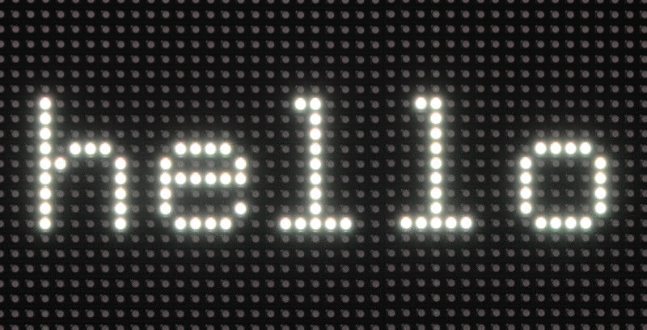
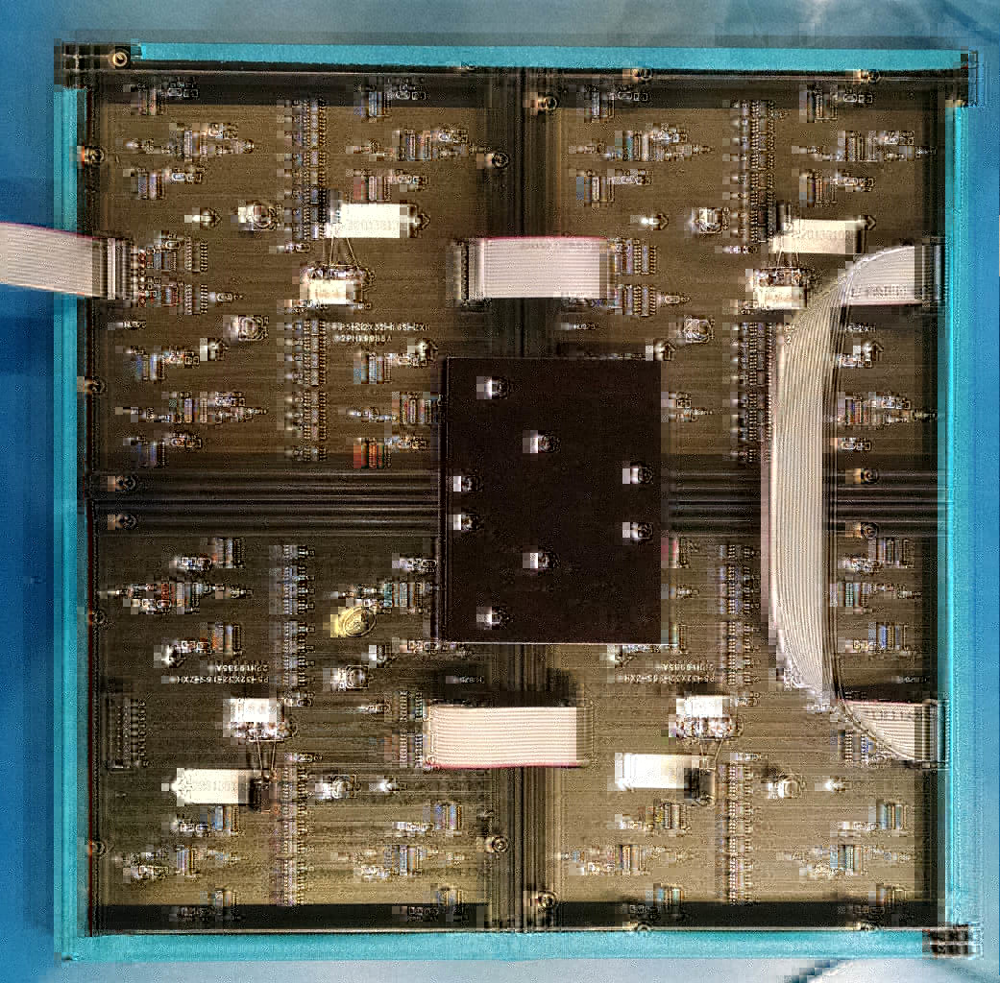

Running some demos
------------------
Let's start by running some demos, then we can dive into code. The
[demo-main.cc](demo-main.cc) has some testing demos. Via command line flags,
you can choose the display type you have (16x32 or 32x32), and how many you
have chained and paralleled. For detailed description of these flags see the
[main README section](../README.md#changing-parameters-via-command-line-flags)
about it.

```
$ make
$ sudo ./demo
usage: ./demo <options> -D <demo-nr> [optional parameter]
Options:
        -D <demo-nr>              : Always needs to be set
        -L                        : Large display, in which each chain is 'folded down'
                                    in the middle in an U-arrangement to get more vertical space.
        -R <rotation>             : Sets the rotation of matrix. Allowed: 0, 90, 180, 270. Default: 0.
        -t <seconds>              : Run for these number of seconds, then exit.
        --led-rows=<rows>         : Panel rows. 8, 16, 32 or 64. (Default: 32).
        --led-chain=<chained>     : Number of daisy-chained panels. (Default: 1).
        --led-parallel=<parallel> : For A/B+ models or RPi2,3b: parallel chains. range=1..3 (Default: 1).
        --led-pwm-bits=<1..11>    : PWM bits (Default: 11).
        --led-brightness=<percent>: Brightness in percent (Default: 100).
        --led-scan-mode=<0..1>    : 0 = progressive; 1 = interlaced (Default: 0).
        --led-show-refresh        : Show refresh rate.
        --led-inverse             : Switch if your matrix has inverse colors on.
        --led-swap-green-blue     : Switch if your matrix has green/blue swapped on.
        --led-pwm-lsb-nanoseconds : PWM Nanoseconds for LSB (Default: 130)
        --led-no-hardware-pulse   : Don't use hardware pin-pulse generation.
        --led-slowdown-gpio=<0..2>: Slowdown GPIO. Needed for faster Pis and/or slower panels (Default: 1).
        --led-daemon              : Make the process run in the background as daemon.
        --led-no-drop-privs       : Don't drop privileges from 'root' after initializing the hardware.
Demos, choosen with -D
        0  - some rotating square
        1  - forward scrolling an image (-m <scroll-ms>)
        2  - backward scrolling an image (-m <scroll-ms>)
        3  - test image: a square
        4  - Pulsing color
        5  - Grayscale Block
        6  - Abelian sandpile model (-m <time-step-ms>)
        7  - Conway's game of life (-m <time-step-ms>)
        8  - Langton's ant (-m <time-step-ms>)
        9  - Volume bars (-m <time-step-ms>)
        10 - Evolution of color (-m <time-step-ms>)
        11 - Brightness pulse generator
Example:
        ./demo -t 10 -D 1 runtext.ppm
Scrolls the runtext for 10 seconds
```

To run the actual demos, you need to run this as root so that the
GPIO pins can be accessed; as soon as that established, the program will drop
the privileges.

Here is how demo '1' looks. It requires a ppm (type raw) with a height of
32 pixel - it is infinitely scrolled over the screen; for
convenience, there is a little runtext.ppm example included:

     $ sudo ./demo -D 1 runtext.ppm

Here is a video of how it looks
[![Runtext][run-vid]](http://youtu.be/OJvEWyvO4ro)

Using the API
-------------
While there is the demo program and the [utilities](../utils), this code can
be used independently as a library to be used in your own programs.
The includes are in `include/`, the library to link is built
in `lib/`. This is a C++ also with C bindings. There is also a
[Python](../python) binding.

Getting started
---------------
The relevant part to start with is to look at
[led-matrix.h](../include/led-matrix.h).

You can would typically use the `CreateMatrixFromFlags()` factory to
create an RGBMatrix and then go from there.

```C++
#include "led-matrix.h"

using rgb_matrix::RGBMatrix;

int main(int argc, char **argv) {
  // Set some defaults
  RGBMatrix::Options my_defaults;
  my_defaults.chain_length = 3;
  my_defaults.show_refresh_rate = true;
  rgb_matrix::RuntimeOptions runtime_defaults;
  runtime_defaults.drop_privileges = 1;
  RGBMatrix *matrix = rgb_matrix::CreateMatrixFromFlags(&argc, &argv,
                                                        &my_defaults,
                                                        &runtime_defaults);
  if (matrix == NULL) {
    PrintMatrixFlags(stderr, my_defaults, runtime_defaults);
    return 1;
  }

  // matrix->ApplyStaticTransformer(...);  // Optional

  // Do your own command line handling with the remaining options.

  //  .. now use matrix

  delete matrix;   // Make sure to delete it in the end.
}
```

The `RGBMatrix` is essentially a canvas, it provides some basic functionality
such as `SetPixel()`, `Fill()` or `Clear()`. If you want to do more, you
might be interested in functions provided in the
[graphics.h](../include/graphics.h) header.

If you have animations, you might be interested in double-buffering. There is
a way to create new canvases with `CreateFrameCanvas()`, and then use
`SwapOnVSync()` to change the content atomically. See API documentation for
details.

Start with the [minimal-example.cc](./minimal-example.cc) to start.

If you are interested in drawing text and the font drawing functions in
graphics.h, have a look at the [text example](./text-example.cc):

```
sudo ./text-example -f ../fonts/8x13.bdf
hello
```



Integrating in your own application
-----------------------------------
Until this library shows up in your favorite Linux distribution, you can just
include the library via github; it is pretty easy to be up-to-date.

I suggest to add this code as a sub-module in your git repository. That way
you can use that particular version and easily update it if there are changes:

     git submodule add https://github.com/hzeller/rpi-rgb-led-matrix.git matrix

(Read more about how to use [submodules in git][git-submodules])

This will check out the repository in a subdirectory `matrix/`.
The library to build would be in directory `matrix/lib`, so let's hook that
into your toplevel Makefile.
I suggest to set up some variables like this; you only need to change the
location `RGB_LIB_DISTRIBUTION` is pointing to; in the sub-module example, this
was the `matrix` directory:

     RGB_LIB_DISTRIBUTION=matrix
     RGB_INCDIR=$(RGB_LIB_DISTRIBUTION)/include
     RGB_LIBDIR=$(RGB_LIB_DISTRIBUTION)/lib
     RGB_LIBRARY_NAME=rgbmatrix
     RGB_LIBRARY=$(RGB_LIBDIR)/lib$(RGB_LIBRARY_NAME).a
     LDFLAGS+=-L$(RGB_LIBDIR) -l$(RGB_LIBRARY_NAME) -lrt -lm -lpthread

Also, you want to add a target to build the libary in your sub-module

	 # (FYI: Make sure, there is a TAB-character in front of the $(MAKE))
     $(RGB_LIBRARY):
		 $(MAKE) -C $(RGB_LIBDIR)

Now, your final binary needs to depend on your objects and also the
`$(RGB_LIBRARY)`

     my-binary : $(OBJECTS) $(RGB_LIBRARY)
	     $(CXX) $(CXXFLAGS) $(OBJECTS) -o $@ $(LDFLAGS)

As an example, see the [PixelPusher implementation][pixelpush] which is using
this library in a git sub-module.

If you are writing your own Makefile, make sure to pass the `-O3` option to
the compiler to make sure to generate fast code.

Note, all the types provided are in the `rgb_matrix` namespace. That way, they
won't clash with other types you might use in your code; in particular pretty
common names such as `GPIO` or `Canvas` might run into clashing trouble.

Anyway, for convenience you just might add using-declarations in your
code:

     // Types exported by the RGB-Matrix library.
     using rgb_matrix::Canvas;
     using rgb_matrix::GPIO;
     using rgb_matrix::RGBMatrix;
     using rgb_matrix::ThreadedCanvasManipulator;

Or, if you are lazy, just import the whole namespace:

     using namespace rgb_matrix;

Read the [`minimal-example.cc`](./minimal-example.cc) to get started, then
have a look into [`demo-main.cc`](./demo-main.cc).

## Remapping coordinates ##
You might choose a different physical layout than the wiring provides.

Say you have 4 displays with 32x32 and only a single output
like with a Raspberry Pi 1 or the Adafruit HAT -- if we chain
them, we get a display 32 pixel high, (4*32)=128 pixel long. If we arrange
the boards in a U-shape so that they form a square, we get a logical display
of 64x64 pixels:

 In action:
[![PixelPusher video][pp-vid]](http://youtu.be/ZglGuMaKvpY)

```
So the following chain
    [<][<][<][<] }- Raspbery Pi connector

is arranged in this U-shape (on its side)
    [<][<] }----- Raspberry Pi connector
    [>][>]
```

How can we make this 'folded' 128x32 screen behave like a 64x64 screen ?

In the API, there is an interface to implement,
a [`CanvasTransformer`](./include/canvas.h) that allows to program
re-arrangements of pixels in any way. You can plug such a `CanvasTransformer`
into the RGBMatrix to use the new layout.

```
void RGBMatrix::ApplyStaticTransformer(const CanvasTransformer &transformer)
```

Sometimes you even need this for the panel itself: In newer panels
(often with 1:4 multiplexing) the pixels are often not mapped in
a straight-forward way, but in a snake arrangement for instance.
The CanvasTransformer allows you to work around that (I recently have gotten
some of these to test myself. This will be a new multiplexing option soon).

Back to the 64x64 arrangement:

There is a sample implementation `class UArrangementTransformer` that maps
any U-arrangement into a logical arrangement with half the width and double
the height. So the 128x32 pixel logical arrangement would be a
64x64 arrangement doing the coordinate mapping.

```
  matrix->ApplyStaticTransformer(UArrangementTransformer());
```

In the demo program and the [`led-image-viewer`](../utils#image-viewer), you
can activate this with the `-L` option. Give it the original chain length (so
for the 64x64 arrangement that would be `--led-chain=4`).

This works for longer and more than one chain as well. Here an arrangement with
two chains with 8 panels each

```
   [<][<][<][<]  }--- Pi connector #1
   [>][>][>][>]
   [<][<][<][<]  }--- Pi connector #2
   [>][>][>][>]
```

(`--led-chain=8 --led-parallel=2 -L`).

Note, if you use the parallel chains in your programs, you need to pass the
number of parallel chains to the `UArrangementTransformer`. For instance from
the defaults you used to create the Matrix:

```
  matrix->ApplyStaticTransformer(UArrangementTransformer(my_defaults.parallel));
```

[time]: ../img/time-display.jpg
[run-vid]: ../img/running-vid.jpg
[git-submodules]: http://git-scm.com/book/en/Git-Tools-Submodules
[pixelpush]: https://github.com/hzeller/rpi-matrix-pixelpusher
[pp-vid]: ../img/pixelpusher-vid.jpg
