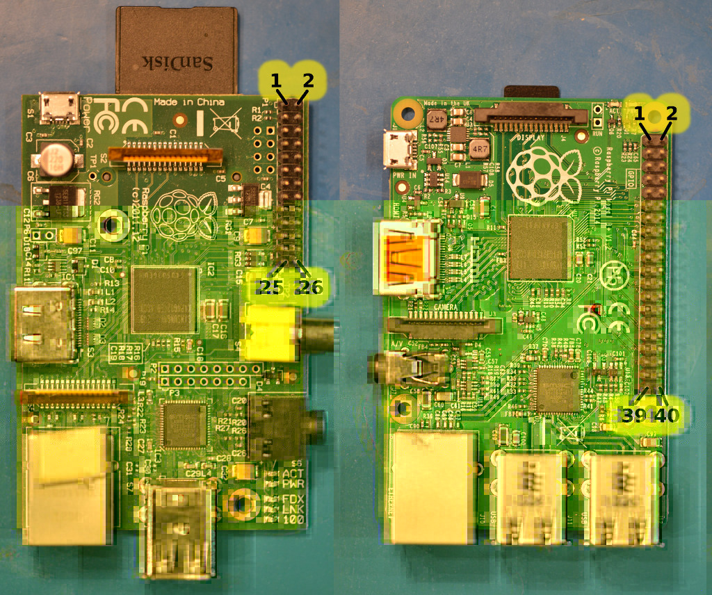

Connection
----------
You need a separate power supply for the panel. There is a connector for that
separate from the logic connector, typically a big one in the center of the
board. The board requires 5V (double check the polarity: what is printed
on the board is correct - I once got boards with supplied cables that had red
(suggesting `+`) and black (suggesting `GND`) reversed!). This power supply is
used to light the LEDs; plan for ~3.5 Ampere per 32x32 panel.

The connector on the RGB panels is called a Hub75 interface. Each panel
typically has two ports, one is the input and the other is the output to
chain additional panels. Usually an arrow shows which of the connectors is
the input.

Here you see a Hub75 connector to be seen at the bottom of the RGB panel
board including the arrow indicating the input direction:
![Hub 75 interface][hub75-arrow]

Other boards are very similar, but instead of zero-indexed color bits
`R0`, `G0`, `B0`, `R1`, `G1`, `B1`, they start the index with one and name these
`R1`, `G1`, `B1`, `R2`, `G2`, `B2`; the functionality is identical.
![Hub 75 interface][hub75]

Throughout this document, we will use the one-index base, so we will call these
signals `R1`, `G1`, `B1`, `R2`, `G2`, `B2` below.

The `strobe` signals is sometimes also called `latch` or `lat`. We'll call it
`strobe` here.

If you plug an IDC-cable into your RGB panel to the input connector, this is
how the signal positions are on the other end of the cable (imagine the LED
panels somewhere outside the picture on the left); note the notch on the right
side of the connector:
![Hub 75 IDC connector][hub75-idc]

The RPi only has 3.3V logic output level, but many displays operated at 5V
interprets these logic levels fine, just make sure to run a short
cable to the board.
If you do run into glitches or erratic pixels, consider some line-buffering,
e.g. using the [active adapter PCB](./adapter/).
Since we only need output pins on the RPi, we don't need to worry about level
conversion back.

For a single chain of LED-panels, we need 13 IO lines, which fit all in the
header of the old Raspberry Pis. Newer Raspberry Pis with 40 pins have more
GPIO lines which allows us to connect three parallel chains of RGB panels.

For reference, this is how the numbering on the Raspberry Pi looks like:

This is the same representation used in the table below, which helps for
visual inspection.

### Wiring diagram

For each of the up to three chains, you have to connect `GND`, `strobe`,
`clock`, `OE-`, `A`, `B`, `C`, `D` to all of these (the `D` line is needed
for 32x32 displays; 32x16 displays don't need it). If you have a 64x64 display,
these have an additional `E` line which is typically on Pin 4 or 8 on the
matrix connector.
You find the positions of the pins on the Raspberry Pi and the corresponding
logical connections in the table below (there are more GND pins on the
Raspberry Pi, but they are left out for simplicity).

Then for each panel, there is a set of (R1, G1, B1, R2, G2, B2) that you have
to connect to the corresponding pins that are marked `[1]`, `[2]` and `[3]` for
chain 1, 2, and 3 below.
If you only connect one panel or have one chain, connect it to `[1]` (:smile:); if you
use parallel chains, add the other `[2]` and `[3]`.

To make things quicker to navigate visually, each chain is marked with a separate
icon:

`[1]`=:smile:, `[2]`=:boom: and `[3]`=:droplet: ; signals that go to all
chains have all icons.

|Connection                        | Pin | Pin |  Connection
|---------------------------------:|:---:|:---:|:-----------------------------
|                             -    |   1 |   2 | -
|             :droplet: **[3] G1** |   3 |   4 | -
|             :droplet: **[3] B1** |   5 |   6 | **GND** :smile::boom::droplet:
|:smile::boom::droplet: **strobe** |   7 |   8 | **[3] R1** :droplet:
|                              -   |   9 |  10 | **E**    :smile::boom::droplet: (for 64 row matrix, 1:32)
|:smile::boom::droplet: **clock**  |  11 |  12 | **OE-**  :smile::boom::droplet:
|              :smile:  **[1] G1** |  13 |  14 | -
|:smile::boom::droplet:      **A** |  15 |  16 | **B**    :smile::boom::droplet:
|                             -    |  17 |  18 | **C**    :smile::boom::droplet:
|              :smile:  **[1] B2** |  19 |  20 | -
|              :smile:  **[1] G2** |  21 |  22 | **D**    :smile::boom::droplet: (for 32 row matrix, 1:16)
|              :smile:  **[1] R1** |  23 |  24 | **[1] R2** :smile:
|                             -    |  25 |  26 | **[1] B1** :smile:
|                             -    |  27 |  28 | -
|              :boom:   **[2] G1** |  29 |  30 | -
|              :boom:   **[2] B1** |  31 |  32 | **[2] R1** :boom:
|              :boom:   **[2] G2** |  33 |  34 | -
|              :boom:   **[2] R2** |  35 |  36 | **[3] G2** :droplet:
|              :droplet:**[3] R2** |  37 |  38 | **[2] B2** :boom:
|                              -   |  39 |  40 | **[3] B2** :droplet:

In the [adapter/](./adapter) directory, there are some boards that make
the wiring task simpler.

### Chains

You connect the Pi to the first element in the chain of panels. Each panel has
an output connector, that you then can connect to the next panel. Thus you can
create a larger panel. Here a schematic view, below in the 'Power' section, you
can see a real-live panel with three chains of 5 panels each seen from the back.

![Coordinate overview][coordinates]

### Alternative Hardware Mappings

The hardware mapping described above is the 'regular' hardware mapping, which
is the default for this library. However, there are alternative hardware
mappings to choose from, e.g. Adafruit sells a board where they choose a
different mapping.
You can choose with the `--led-gpio-mapping` flag.

If you got an adapter board that is from some unknown source and you don't
get any output: double check the GPIO mappings they use.

You have relative freedom to assign any pins to the output of your choosing,
just add a new mapping in [lib/hardware-mapping.c](lib/hardware-mapping.c),
recompile and it will be provided as a new option in `--led-gpio-mapping`.

Table: GPIO-pins for each hardware mapping

|         | regular | adafruit-hat | adafruit-hat-pwm | regular-pi1 | classic | classic-pi1 |
----------|---------|--------------|------------------|-------------|---------|-------------|
Parallel chains|        3|             1|                 1|            1|        3|            1|
~OE       |GPIO 18  |GPIO 4        |GPIO 18           |GPIO 18      |GPIO 27  |GPIO 0       |
Clock     |GPIO 17  |GPIO 17       |GPIO 17           |GPIO 17      |GPIO 11  |GPIO 1       |
Strobe    |GPIO 4   |GPIO 21       |GPIO 21           |GPIO 4       |GPIO 4   |GPIO 4       |
A         |GPIO 22  |GPIO 22       |GPIO 22           |GPIO 22      |GPIO 7   |GPIO 7       |
B         |GPIO 23  |GPIO 26       |GPIO 26           |GPIO 23      |GPIO 8   |GPIO 8       |
C         |GPIO 24  |GPIO 27       |GPIO 27           |GPIO 24      |GPIO 9   |GPIO 9       |
D         |GPIO 25  |GPIO 20       |GPIO 20           |GPIO 25      |GPIO 10  |GPIO 10      |
E         |GPIO 15  |GPIO 24       |GPIO 24           |GPIO 15      |        -|            -|
Chain 1/R1|GPIO 11  |GPIO 5        |GPIO 5            |GPIO 11      |GPIO 17  |GPIO 17      |
Chain 1/G1|GPIO 27  |GPIO 13       |GPIO 13           |GPIO 21      |GPIO 18  |GPIO 18      |
Chain 1/B1|GPIO 7   |GPIO 6        |GPIO 6            |GPIO 7       |GPIO 22  |GPIO 22      |
Chain 1/R2|GPIO 8   |GPIO 12       |GPIO 12           |GPIO 8       |GPIO 23  |GPIO 23      |
Chain 1/G2|GPIO 9   |GPIO 16       |GPIO 16           |GPIO 9       |GPIO 24  |GPIO 24      |
Chain 1/B2|GPIO 10  |GPIO 23       |GPIO 23           |GPIO 10      |GPIO 25  |GPIO 25      |
Chain 2/R1|GPIO 12  |             -|                 -|            -|GPIO 12  |            -|
Chain 2/G1|GPIO 5   |             -|                 -|            -|GPIO 5   |            -|
Chain 2/B1|GPIO 6   |             -|                 -|            -|GPIO 6   |            -|
Chain 2/R2|GPIO 19  |             -|                 -|            -|GPIO 19  |            -|
Chain 2/G2|GPIO 13  |             -|                 -|            -|GPIO 13  |            -|
Chain 2/B2|GPIO 20  |             -|                 -|            -|GPIO 20  |            -|
Chain 3/R1|GPIO 14  |             -|                 -|            -|GPIO 14  |            -|
Chain 3/G1|GPIO 2   |             -|                 -|            -|GPIO 2   |            -|
Chain 3/B1|GPIO 3   |             -|                 -|            -|GPIO 3   |            -|
Chain 3/R2|GPIO 26  |             -|                 -|            -|GPIO 15  |            -|
Chain 3/G2|GPIO 16  |             -|                 -|            -|GPIO 26  |            -|
Chain 3/B2|GPIO 21  |             -|                 -|            -|GPIO 21  |            -|

A word about power
------------------

These displays suck a lot of current. At 5V, when all LEDs are on (full white),
my 32x32 LED panel draws about 3.4A. For an outdoor panel that is very bright,
that can be twice as much.
That means, you need a beefy power supply to drive these panels; a 2A USB
charger or similar is not enough for a 32x32 panel; it might be for a 16x32.

If you connect multiple boards together, you needs a power supply that can
keep up with 3.5A / panel. Good are old PC power supplies that often
provide > 20A on the 5V rail. Or you can get a dedicated 5V high current
switching power supply for these kind of applications (check eBay).

The current draw is pretty spiky. Due to the PWM of the LEDs, there are very
short peaks of a couple of 100ns to about 1ms of full current draw.
Often, the power cable can't support these very short spikes due to inherent
inductance. This can result in 'noisy' outputs, with random pixels not behaving
as they should. A low ESR capacitor close to the input is good in these cases.

On some displays, the quality of the output quickly gets erratic
when voltage drops below 4.5V. Some even need a little bit higher voltage around
5.5V to work reliably. Also, tweak with the `--led-slowdown-gpio` flag.

When you connect these boards to a power source, the following are good
guidelines:
   - Have fairly thick cables connecting the power to the board.
     Plan not to loose more than 50mV from the source to the LED matrix.
     So that would be 50mV / 3.5A = 14 mΩ. For both supply wires, so 7mΩ
     each trace.
     A 1mm² copper cable has about 17.5mΩ/meter, so you'd need a **2.5mm²
     copper cable per meter and panel**. Multiply by meter and number of
     panels to get the needed cross-section.
     (For Americans: that would be ~13 gauge wire for 3 ft and one panel)

   - While a star configuration for the cabeling would be optimal (each panel gets
     an individual wire from the power supply), it is typically sufficient
     using aluminum mounting brackets or bars as part of
     your power solution. With aluminum of 1mm² specific resistivity of
     about 28mΩ/meter, you'd need a cross sectional area of about 4mm² per panel
     and meter.

     In the following example you see the structural aluminum bars in the middle
     (covered in colored vinyl) dualing as power bars. The 60A/5V power supply is connected
     to the center bolts (display uses about 42A all LEDs on):
     ![Powerbar][powerbar]

   - Often these boards come with cables that have connectors crimped on.
     Some cheap cables are typically too thin; you might want to clip them close to
     the connector solder your proper, thick cable to it.

   - It is good to buffer the current spikes directly at the panel. The most
     spikes happen while PWM-ing a single line.
     So let's say we want to buffer the energy to power a single line without
     dropping more than 50mV. We use 3.5A which is 3.5Joule/second. We do
     about 140Hz refresh rate and divide that in 16 lines, so we need
     3.5 Joule/140/16 = ~1.6mJoule in the time period to display one line.
     We want to get the energy out of the voltage drop of 50mV; so with
     W = 1/2*C*U², we can calculate the capacitance needed:
       C = 2 * 1.6mJoule / ((5V)² - (5V - 50mV)²) = ~6400µF.
     So, 2 x 3300µF low-ESR capacitors in parallel directly
     at the board are a good choice (two, because lower parallel ESR; also
     fits easier under board).
     (In reality, we need of course less, as the highest ripple comes with
      50% duty cyle thus half the current; also the input is recharching all
      the time. But: as engineer plan for maximum and then some; in the picture
      above I am using 1x3300uF per panel and it works fine).

Now welcome your over-engineered power solution :)

[hub75]: ./img/hub75.jpg
[hub75-arrow]: ./img/hub75-other.jpg
[hub75-idc]: ./img/idc-hub75-connector.jpg
[coordinates]: ./img/coordinates.png
[powerbar]: ./img/powerbar.jpg